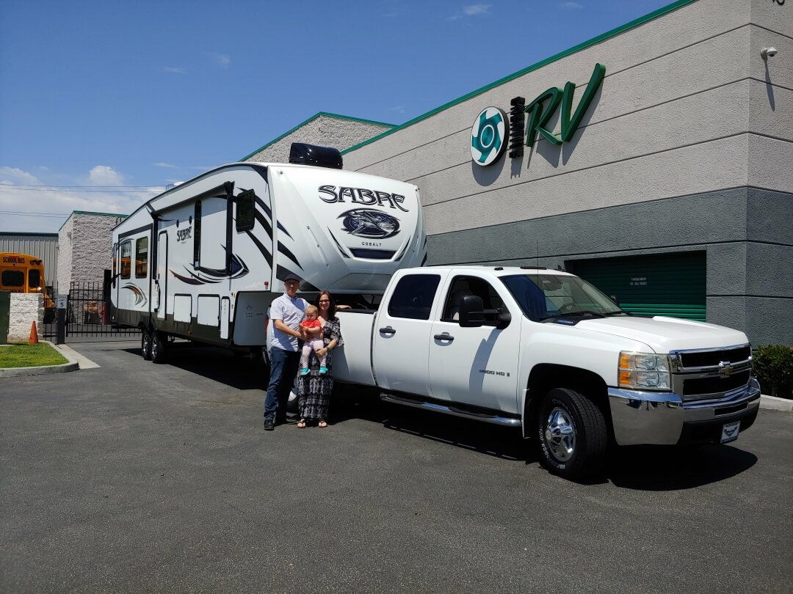

After much thought, research, and planning, we’re almost ready to hit the road! Our first target is Issaquah, Washington (near the Seattle area) where the client James is working with is located. We’re taking our time getting there, going up through Nevada, to a corner of Idaho, over into Oregon, and then into Washington. We don’t have exact dates for all of the locations yet, but we have locked in our reservation in Ely, Nevada for October 1st through 12th.

Rebecca has quit her job and will be trying to keep Ezri out of trouble full time with a little freelance work during naps, while James will continue to work for RedHat and fly back and forth to his client in Issaquah.

You can see our planned stops, potential places to live, and current location on the map at any time. We’ll be updating at least every time we change locations. If you know of cool places we should check out along the way, definitely let us know!
