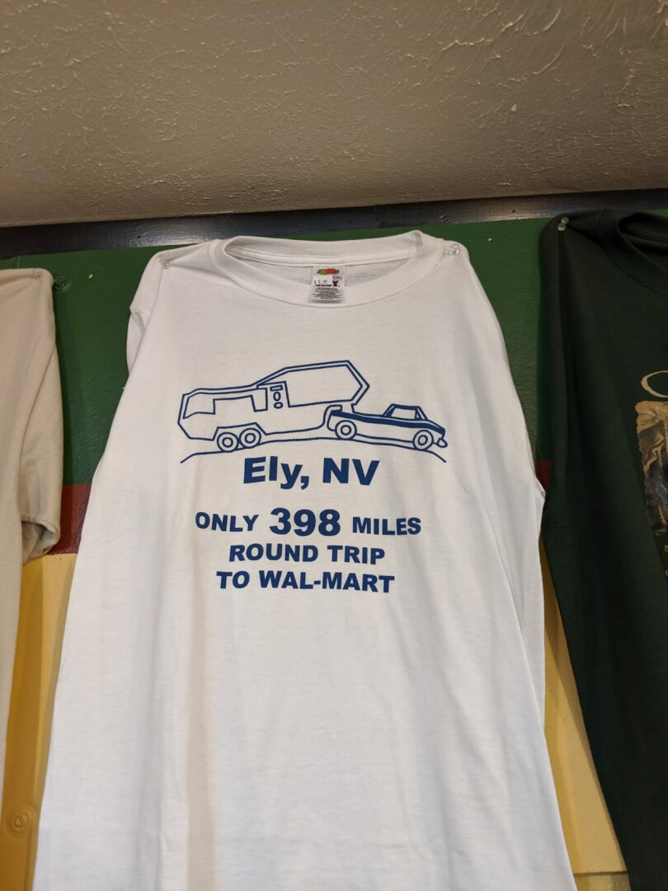

We're getting close to the end of our stay in Ely, and it's been a really great time!

There's a train museum here, with a steam train and a diesel train you can buy tickets for. We rode the steam train, and Ezri had so much fun talking about the train and imitating the choo choo. The ride itself takes 90 minutes, with historical information peppered throughout. We were surprised to learn that in the early 1900s, Ely was the biggest town in Nevada, and had the tallest building (the Nevada Hotel, a whopping 6 stories high). The amount of ore that the trains have hauled during the 1900s was staggering as well, how much was needed for a small amount of copper was very surprising. Ezri has been getting better and better about conquering her fears; it was awesome seeing Ezri go from mildly terrified when we first arrived to absolutely excited and wanting to get closer to the train.

We also went up to Garnet Hill, and found a few super tiny garnets. We're planning on going up to Great Basin National Park this week, and James is trying to convince me we can find space to store a few fishing poles in the RV so we can go fishing at Cave Lake.

It's been a bit colder than we anticipated, but true to high desert, the temperature varies greatly from the night to day. We have gotten a good system of using the propane heater at night while it's below 30, and opening the windows during the day to keep from going above 80 inside. 

The wifi has been slow at best, which I suppose we should have expected (James said he totally saw this one coming). It's done wonders for our streaming habits, and I felt nostalgic today trying to download a file, and watching the estimated time go from 2 days to 3 days, to 5 days, to a download failure. We ordered a Netgear Nighthawk N1 LTE Modem with external antennas, and a few sim cards from Google Fi to get our own network going, a cost we had hoped to hold off until after the house sells, but a necessity for staying sane.

We knew we were going to a remote area, with much fewer amenities, but it really didn't sink in until we saw this shirt in the gift shop. The nearest Walmart will be at our next stop, Elko, which we will be driving to on Saturday.

