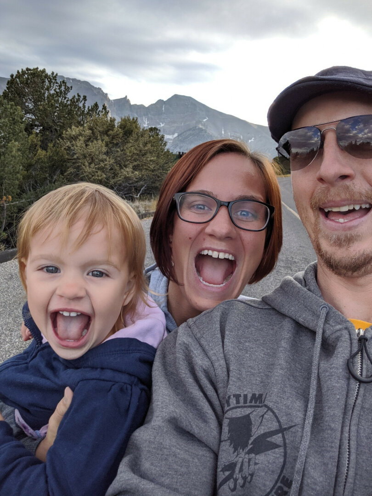
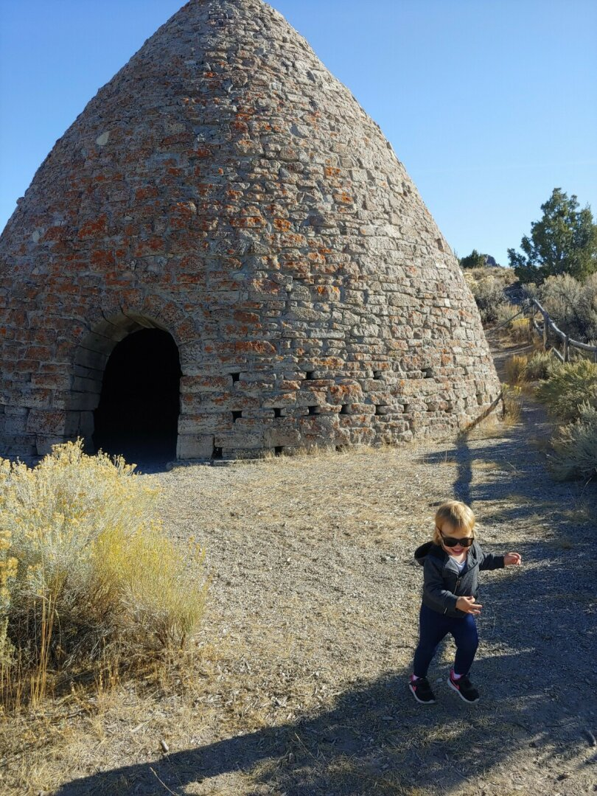
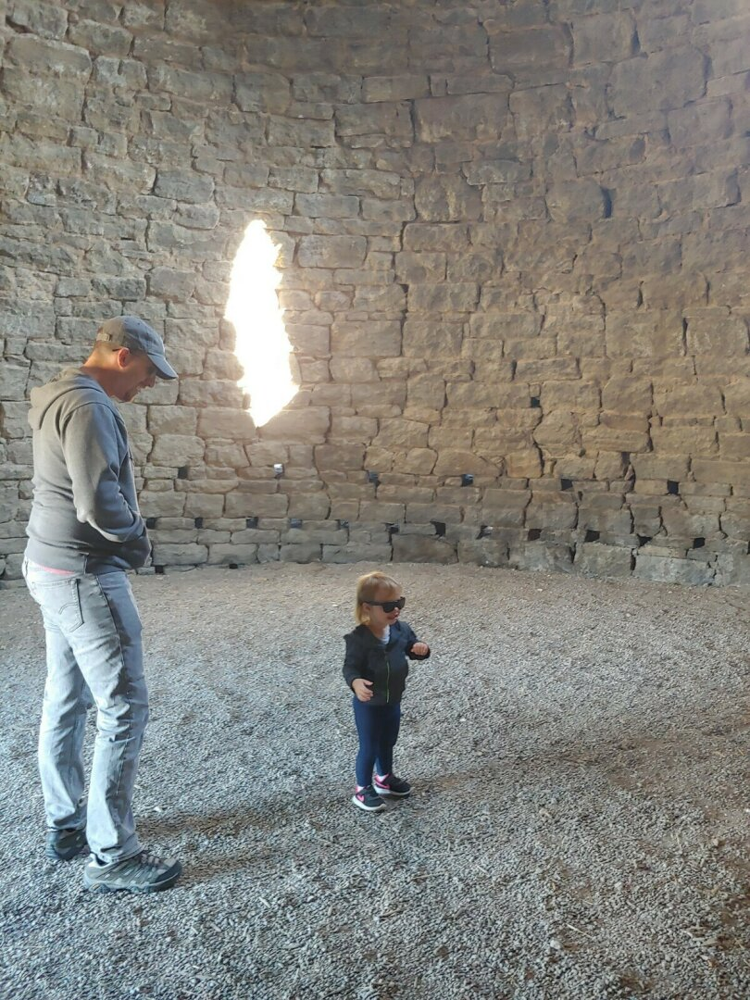
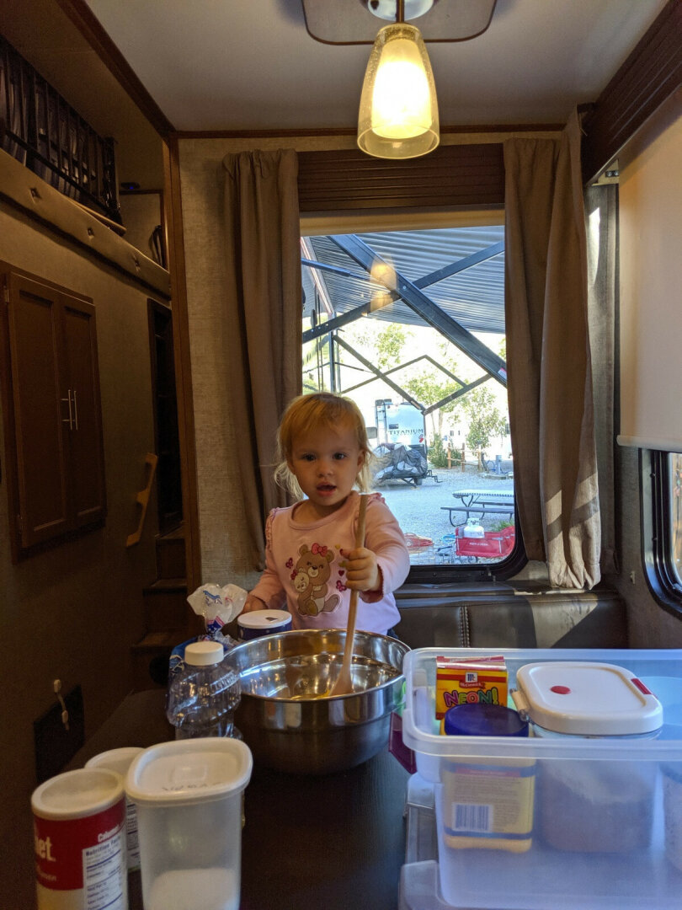
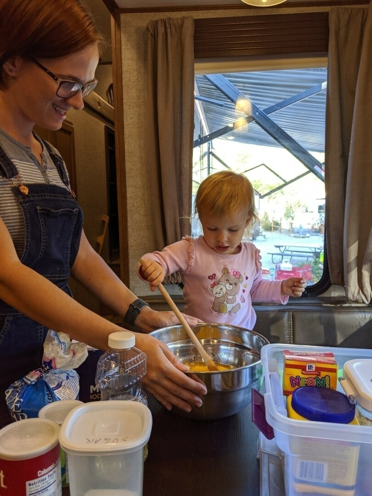
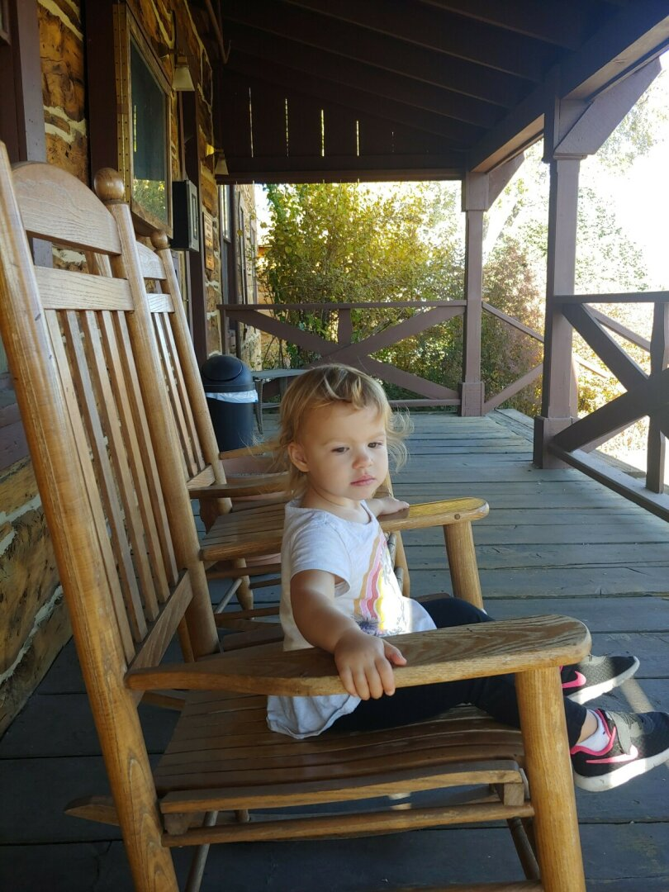
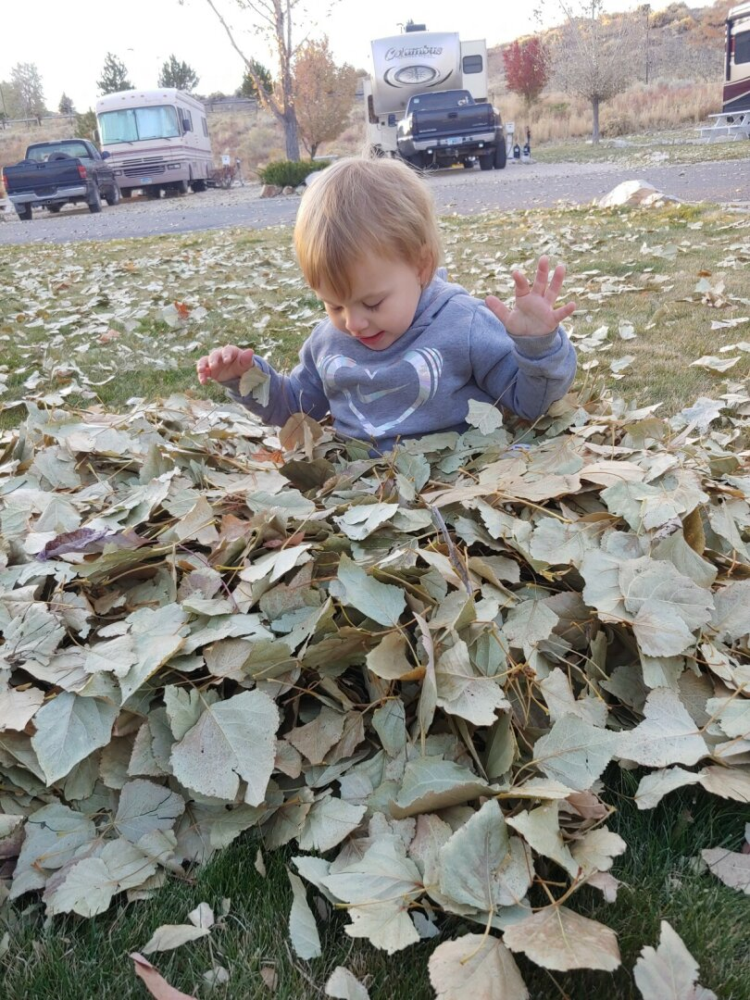
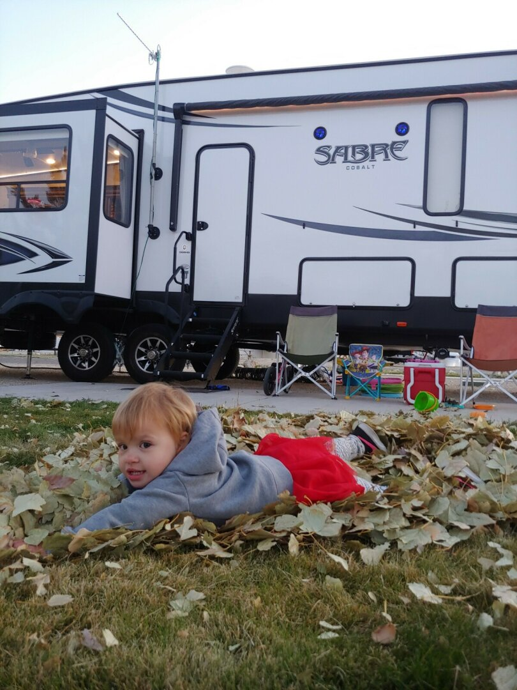
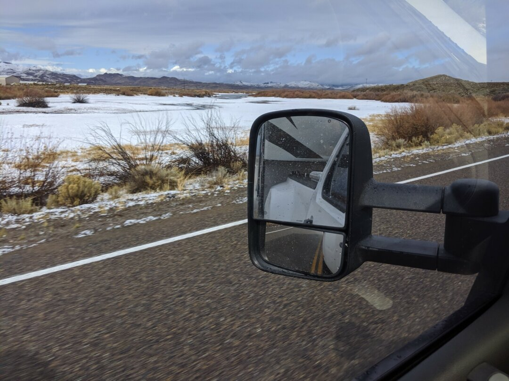

Hi everyone, James here!

For our final week in Ely, we drove out to [Great Basin National Park](https://www.nps.gov/grba/) where we got to see Wheeler Peak, the second highest mountain in Nevada.  This is a wonderful, out of the way park that we really should've spent a few more days exploring. Wheeler Peak is 13,065 ft high, and you can drive to over 10,000 ft in your car - It really hits home just how high you are when you realize that if you were in an airliner, you could go to the bathroom at this height on a normal flight :-)

After visiting the park, including the Peak and doing the Lehman Cave tour, we stopped by an amazing little gourmet restaurant called [Kerouac's](https://www.stargazernevada.com/) started by a couple from New York who started it in 2017. There's not much else on Highway 50, that's why it's known as "*The Loneliest Road in America*". You might go for dozens of miles without seeing anyone else.

We also stopped by the [Ward Charcoal Ovens](http://parks.nv.gov/parks/ward-charcoal-ovens) only used for three years during the 1870s silver boom. Ezri loved playing with the echoes in the ovens, and the surrounding country-side was beautiful and made for a great little day hike.

We wrapped up Ely by Rebecca and Ezri learning to bake together - She loves to be involved in any activity we're doing

### Short stay in Elko, NV

And now, from Rebecca (since James had to travel to Orlando for work):

Ely was a great transition for Elko, since Ezri got used to the sound of trains and was no longer scared of them. All of the RV parks are close to the train tracks, and trains were a normal occurrence for us. Elko was a short stay, only a week. Unfortunately, since we drove on Saturday, and were setting up the RV Sunday, James didn't get much of a chance to see the town before we headed out again the following Saturday.

Ezri and I went to the Chamber of Commerce, which is run from an old fort and has historic wagons and buildings on the lot. The only thing Ezri was really into there was the rocking chairs on their front porch. Next door to that is the Northeastern Nevada Museum, which has some examples of local rocks and gems, and historic clothing and daily living items. They also have a wing with over 200 taxidermy animals from all over the world, many of which I hadn't seen before. 

We got our first glimpse of real fall, and a neighbor loaned us their rake so we could make a pile to play in. Ezri loved playing in the leaves, and helping remake the pile each time it spread out.

The drive to Boise was rather eventful for us. Due to 2 RV parks near Boise having the same name, and a bit of assumption on our part that we were navigating to the same place, a quick stop for gas caused me to take an entirely different route than James, that was an hour longer. By the time we realized the issue, doubling back would cause the same amount of time difference, so I corrected the destination and continued on. We both experienced snow, hail, rain, and extremely high winds on our drive. At one point, my heart rate was high for long enough that FitBit automatically logged an aerobic activity for me, lasting 23 minutes. 

### Onward to Boise, ID

Like Rebecca said, our drive to Boise was pretty interesting, so here is a photo of my snowy drive, at least from before it really started sleeting and before the wind blew so hard and I was too white-knuckled holding the RV on the road to take many pictures!

