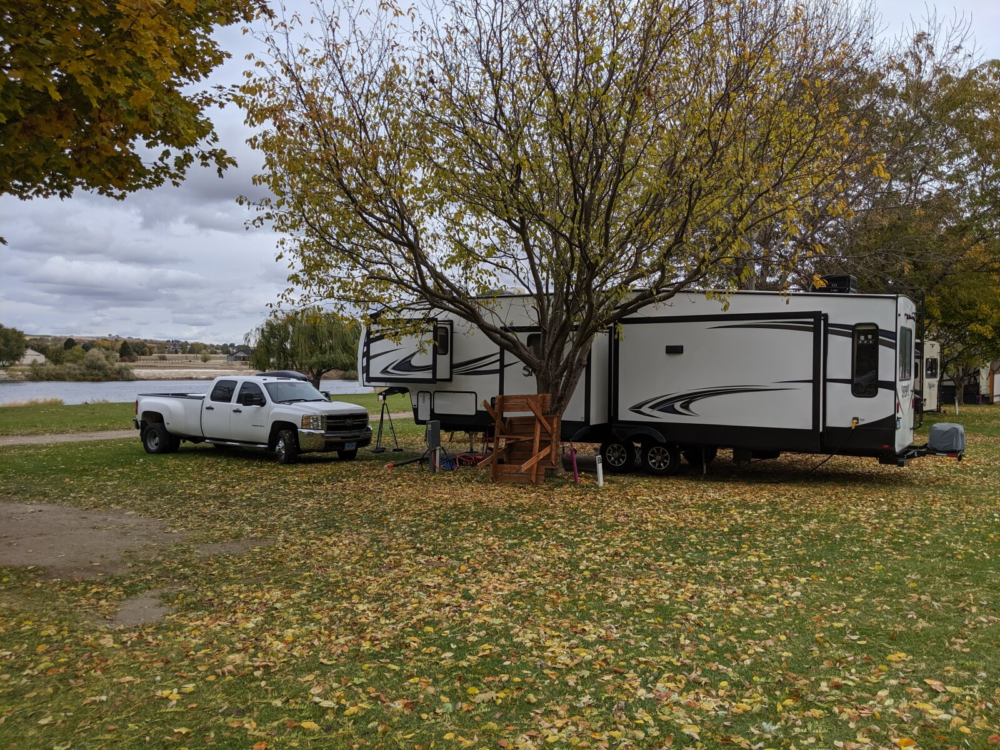
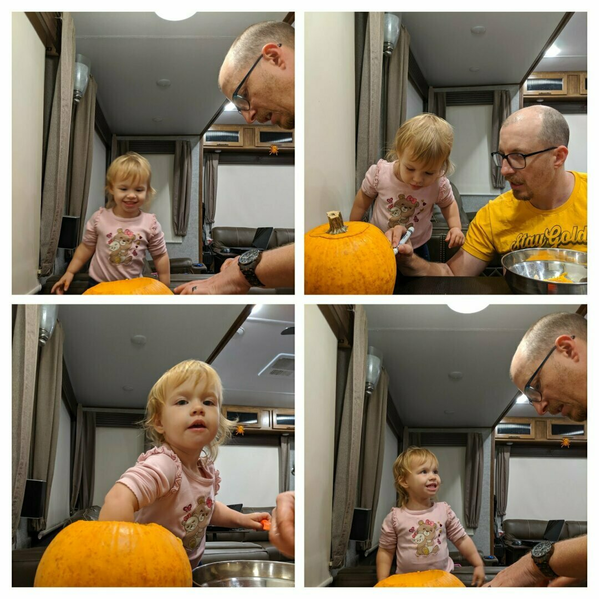
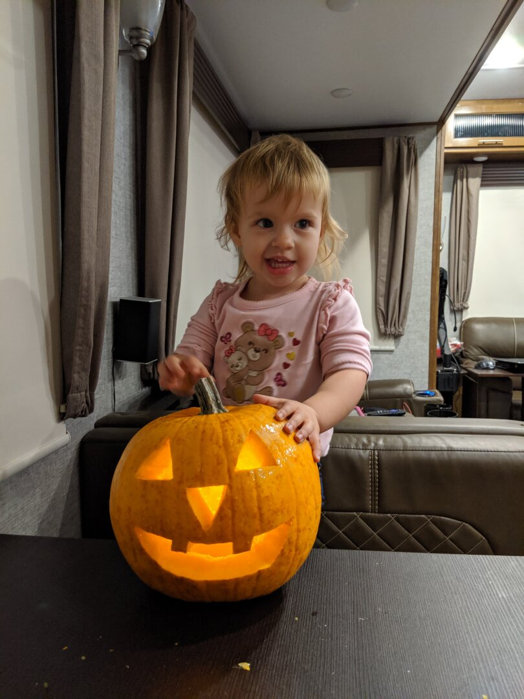
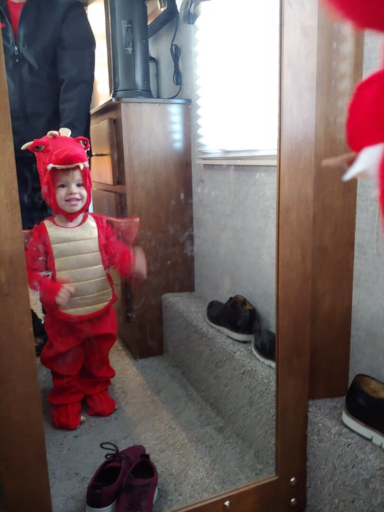
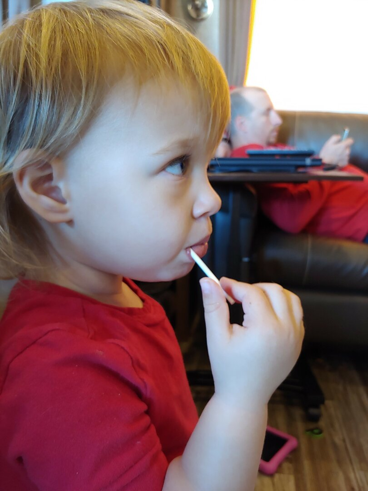
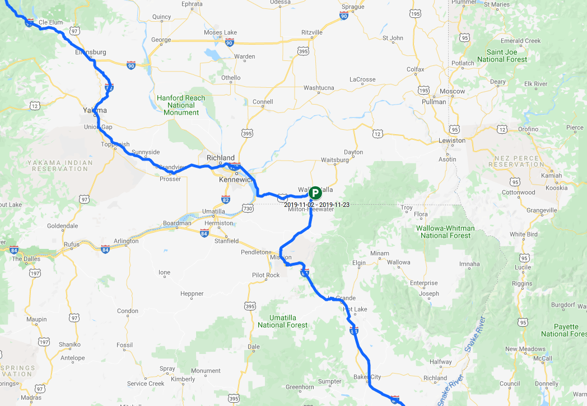

The Boise Idaho area was beautiful, we visited at the perfect time to see the leaves changing color. On our drive we saw several fields of various crops, including hops, corn, alfalfa, apples, and pomegranates. While it got a little chilly at night, most days it was warm enough that we could bundle up and spend time outside.

We decided to stay at the [Snake River Resort RV](https://snakeriverrv.com/) park outside of Boise in Homedale Idaho. It is on the river, with our morning view consisting of ducks and fog rolling on the river each morning. They have a little walking trail that takes you around the neighboring alfalfa field. Ezri's favorite part of the walk on it was finding a grocery bag that had gotten stuck on the fence, freeing it, and filling it with rocks she found along the trail.

In Boise, we visited a Children's Museum, which was much more of a toy collection than a museum, so right up Ezri's alley. She loved playing on a horse that you press down on the 'stirrups' to move forward, and had to spend time hugging all of the stuffed animals in their play vet's office. She also enjoyed the Magna Tiles, especially destroying any creation I put together.

We also went to [The Warhawk Air Museum](https://warhawkairmuseum.org/) in Nampa, which turned out to be a little too hands-off for Ezri (note from James: *definitely check it out if you like restored warbirds, especially the P40, my favorite. They had an incredible amount of historical information.*). They did have 2 sealed domes with gloves attached that are like the ones sometimes used in space to perform experiments when the chemicals involved can be dangerous to the people or equipment. They had a Duplo set inside one, and a Lego set inside the other. Ezri enjoyed trying to grab the pieces with the giant gloves, but also kept trying to get the pieces out by pulling them through the glove holes.

James and Ezri created a Jack-O-Lantern together on the Saturday before Halloween, and we did a trunk or treat on the Sunday. 

For Halloween, they have a trick or treat event where businesses throughout their downtown area opt in to handing out candy. It worked out great for us because we didn't have to intrude on a neighborhood we weren't really a part of. She was pretty shy for most of it, and only spoke to one adult who was dressed up as a butterfly. She definitely was understanding the concept though, and would hold out her bucket for each place we stopped.!

[costume](costume.jpg)

Ezri is almost through eating all of her candy, her favorites have been lollipops by far, but she also liked gummy bears and skittles a lot. I'm looking forward to when she finishes her candy; I haven't been able to keep up with all the sticky hand prints she's been putting on the furniture.

We moved onward to Walla Walla Washington on November 2nd, and so far it's been great as well, we'll have more updates soon! ( Don't forget to checkout out the [Route Map](/map/) link for current location and planned stops)

