[Blue Valley RV Park](https://www.bluevalleyrv.com/) we stayed at in Walla Walla had a great paved path that connected to the park, then went alongside a golf-course, some fields, and a few neighborhoods. With adding a few loops around a track that wasn't far off the path, I was able to run a full 10k. Unfortunately, I also discovered a recurring leg pain I thought I had rested away was not actually gone yet. Doing some research into proper gait and posture when running with a stroller, and hopefully I can get that one solved soon. 

The town itself was really great; The downtown area was very walkable, and there were vineyards and wine tasting rooms everywhere. We found a wonderful restaraunt called [Maple Counter Cafe](https://maplecountercafe.com/)

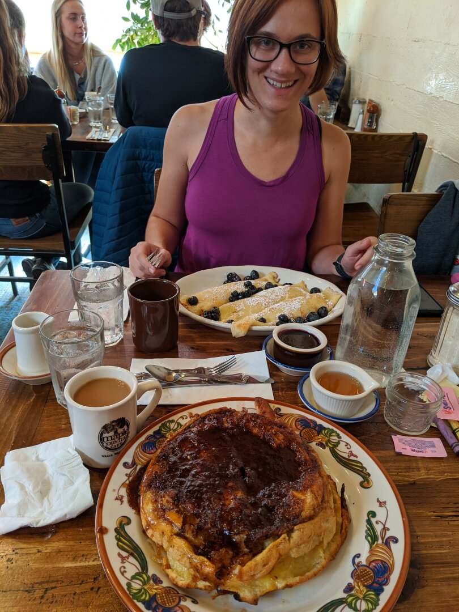

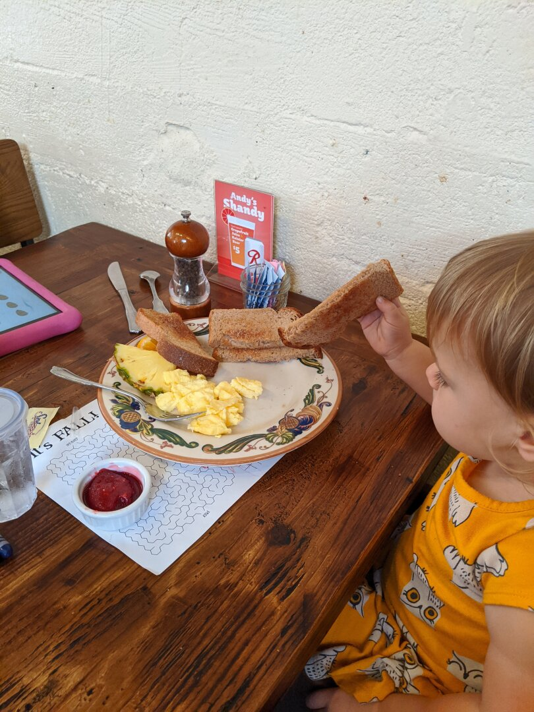

Walla Walla didn't have a lot of indoor kids activities due to its size, but they did have a Children's Museum. Ezri had a blast there; they had a water table with sand and toys so you could make dams, redirect the water, and generally just make a mess. They also had a climbing wall with a slide at the top that she had a lot of fun on, and a giant tube with a fan underneath it that you could put scarves and ribbons under: the air would catch them, spin them up, and out the top.

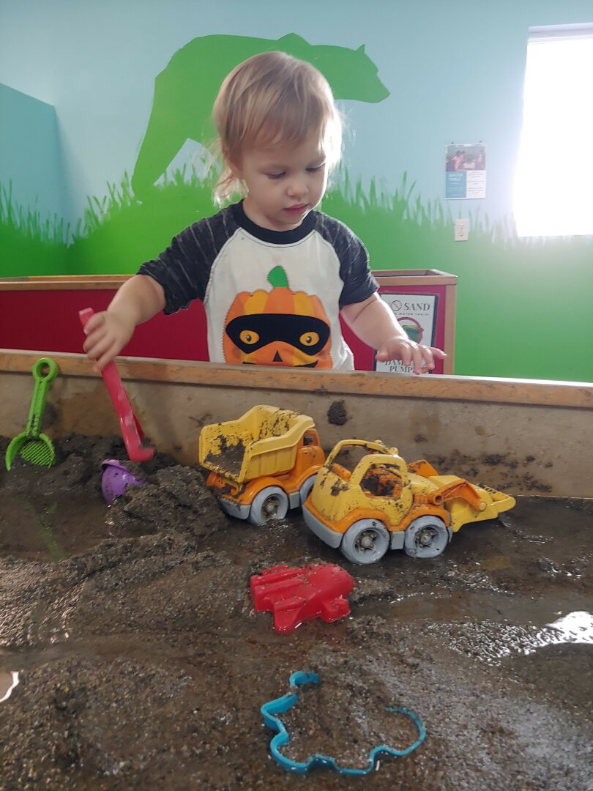

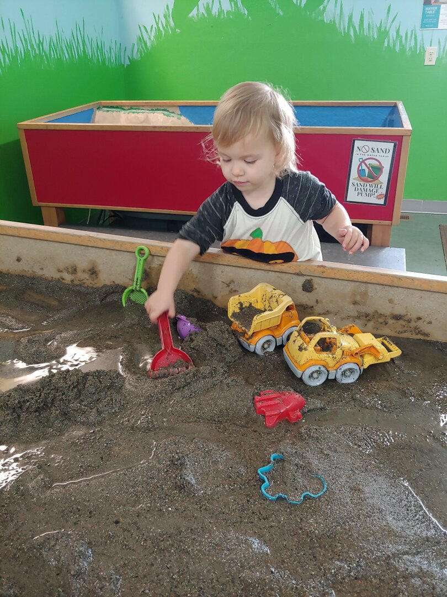

We were very lucky that we were in town when a local business was celebrating a big anniversary. They threw a party at the local fairgrounds, and Ezri and I got to go. (James was in Las Vegas, more about that next.) At first, the sheer number of people and noise level was a lot for her to handle, and she needed to be held while covering her ears. After about 20 minutes though, she relaxed a little. I was surprised when Ezri wanted to go into a bounce house with the bigger kids, but figured worst case I'd go in there and get her if it was too much. She LOVED it. Once I even had to tell some older girls who thought she was too young to stop holding her hands and let her jump. They also had a huge inflatable slide that Ezri wanted to try. I thought the climb up might be too much, but sure enough, she went for it and had a ball. I wasn't able to catch a picture of her at the top, but you can see her right after she got to the bottom of the slide. She was the last one out of the bounce house. She didn't want to leave and I had to go in and get her so they could shut it down.

**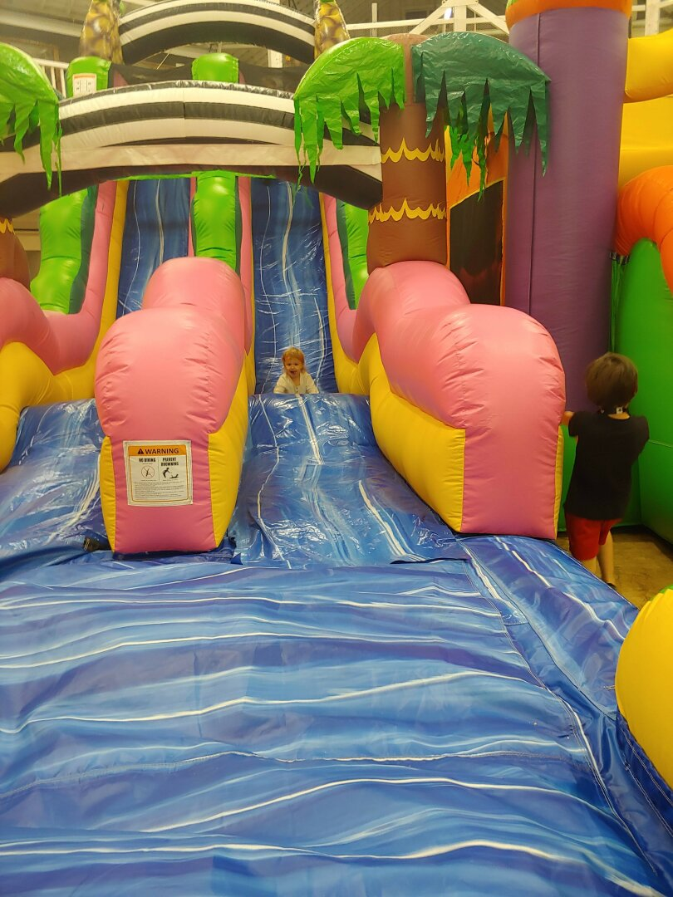**

**Our house is finally, completely, sold!** James had to spend a weekend in Las Vegas packing up all of the furniture we had left for staging and moving it into storage. We loved that house, but it's great to no longer be paying for the mortgage and utilities on top of our expenses on the road.

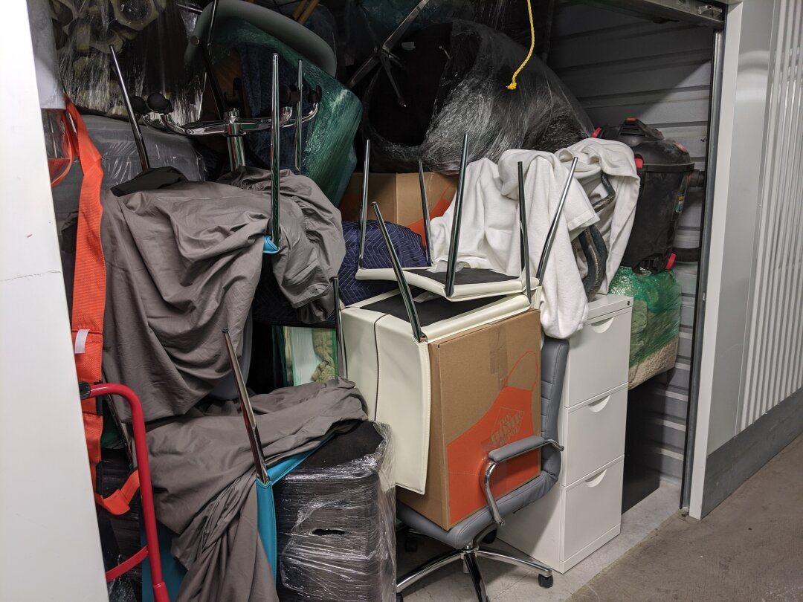

Walla Walla was very foggy, at least half of the days we were there had fog, with most of those being bad enough for there to be weather advisories. I can confidently say I do not enjoy being in fog for more than a day at a time, it starts to feel a little claustrophobic. 

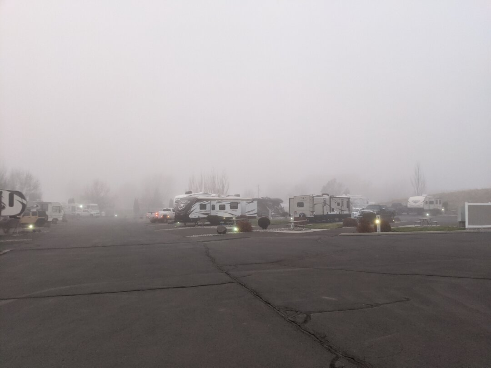

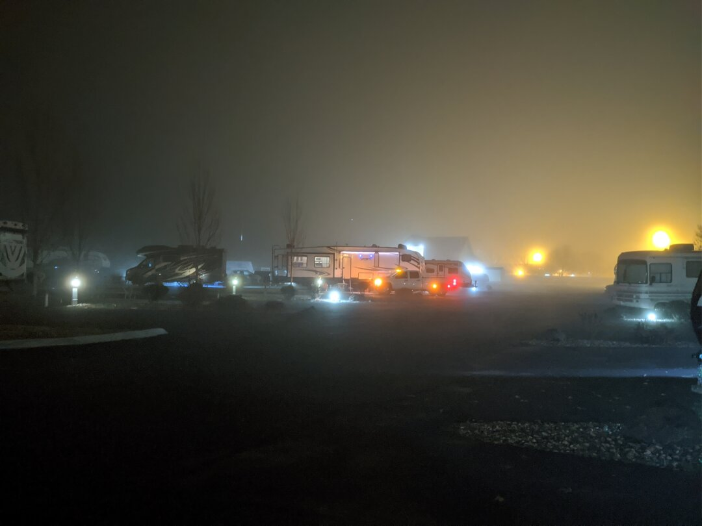

Unfortunately, my car started acting up about halfway through our stay. When it wouldn't turn over one morning, I assumed a dead battery, but testing at the AutoZone didn't uncover any obvious issue other than the battery being low. Testing the alternator revealed a too high ripple so we thought just replacing the battery wouldn't solve our problem. I bought a battery jump starter, and used that for most of the time we were there, but the last few days the battery was so bad that the electronics weren't acting right, headlights would turn off randomly, so it wasn't safe to drive anymore.

My car is still covered under warranty, but the nearest dealership was over 200 miles away in Tacoma, Washington. Luckily Mini roadside assistance policy is a free tow to the nearest dealership. I had to remind the worker I talked to of that before they agreed to cover it, but ultimately won out and got them to pay for the tow. Ezri and I rode in the truck to Issaquah with James, which was both good and bad. It was nice being all together, but I didn't realize just how much comfort I get from following behind the RV and being able to see there are no issues with it.

Once we got the car to the dealership, they declared all that was wrong was a bad battery, and covered that under the warranty. I'm still sceptical, but luckily we are close by so if this battery dies too, at least it won't be as big of an ordeal.

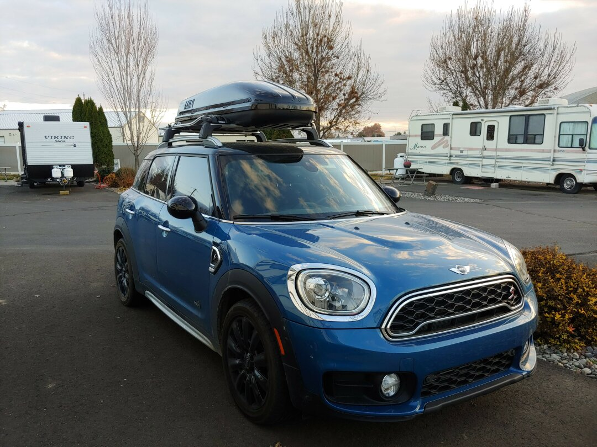

It's unfortunate that we weren't able to spend a little more time together as a family in Walla Walla because of the Las Vegas trip, but we wanted to get over the mountains before the ice and snow hit [Snoqualmie Pass](https://www.wsdot.com/traffic/passes/snoqualmie/).

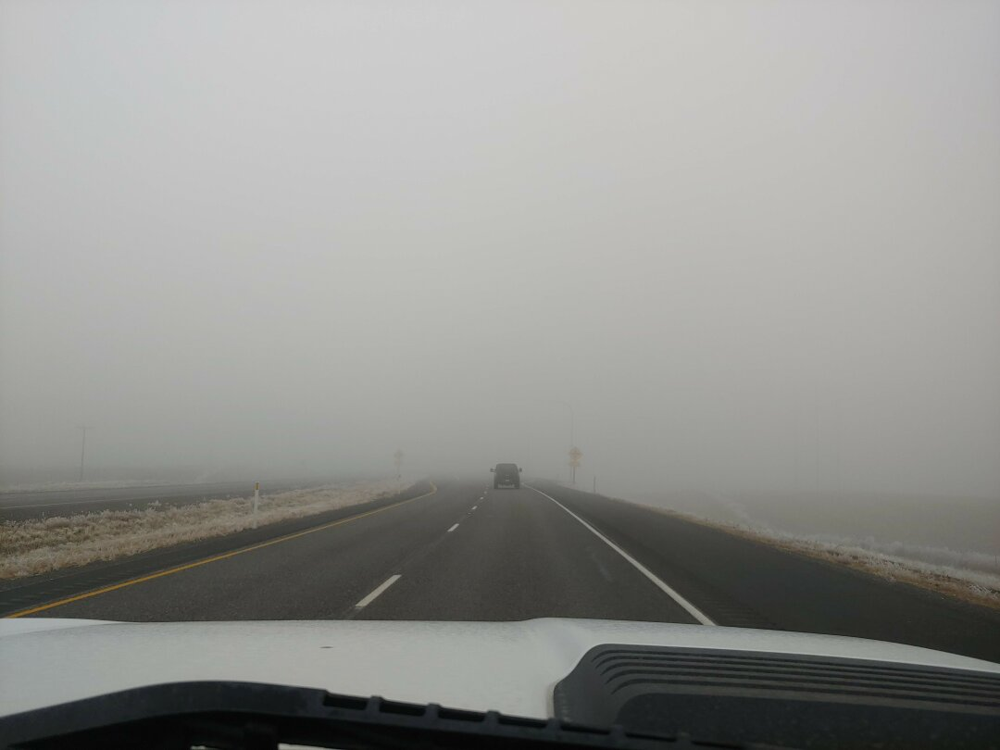

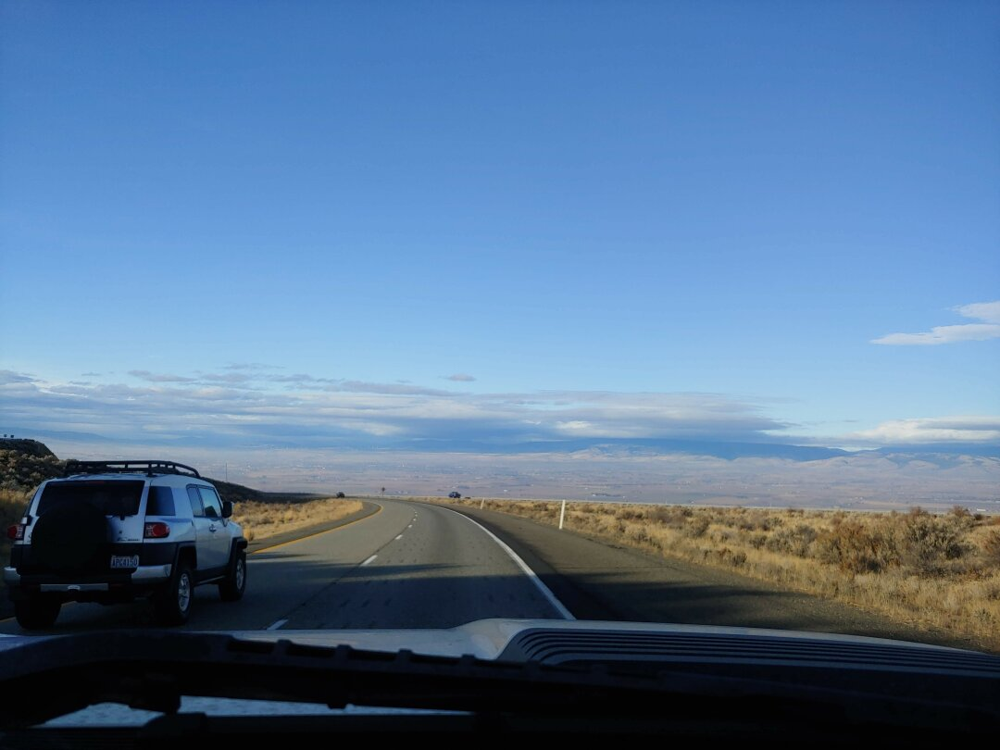

We arrived in Fall City, Washington near Issaquah on November 23rd. We just paid for a long-term stay until March 7th since James will be working in the area for the next couple of months at least, and it should be a nice place to wait out Winter. We'll have another post about our last few weeks here at [Tall Chief RV Resort](https://www.rvonthego.com/washington/tall-chief-rv-camping-resort/) in the next few days, stay tuned!

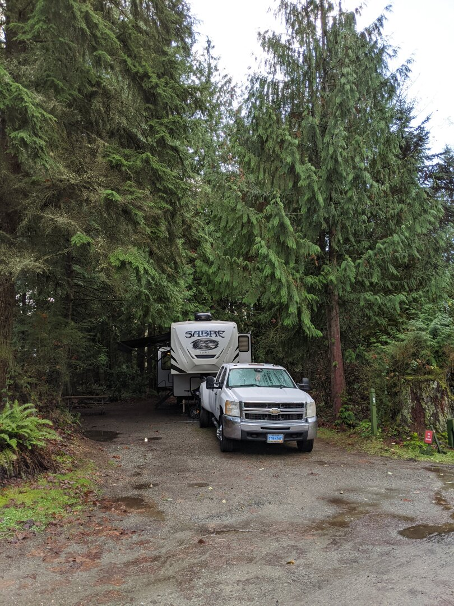

*James Note: Sorry for so few pictures of Walla Walla without fog, it wasn't always dreary looking, we were just busy!*