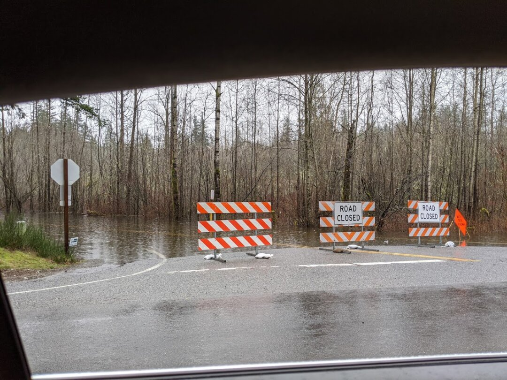
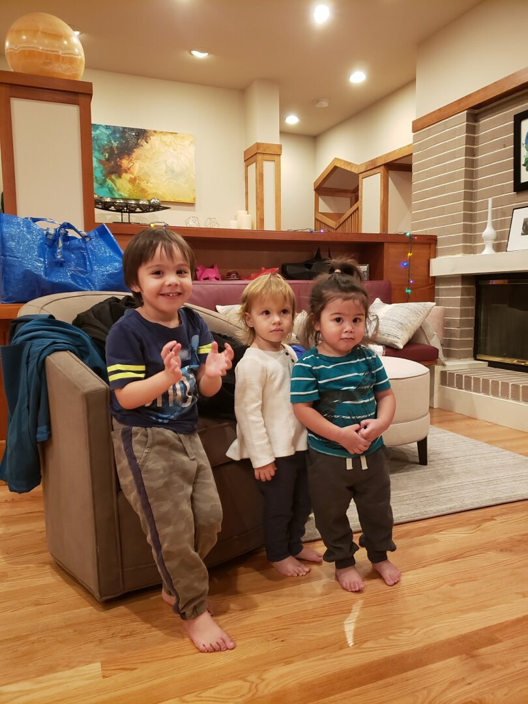
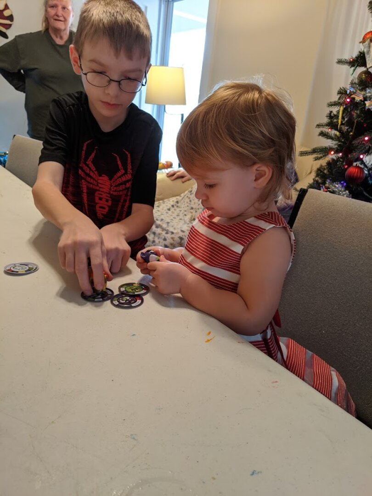
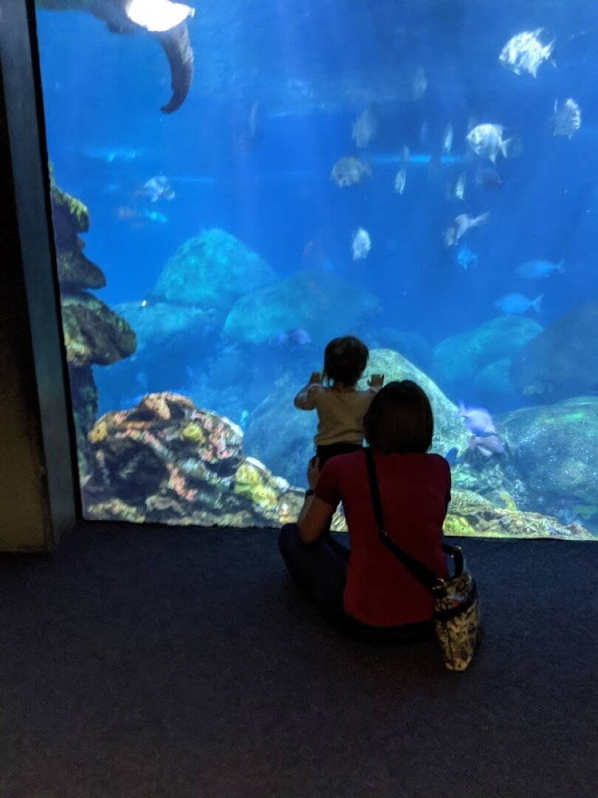
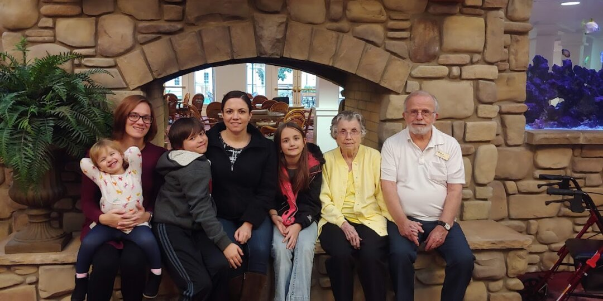
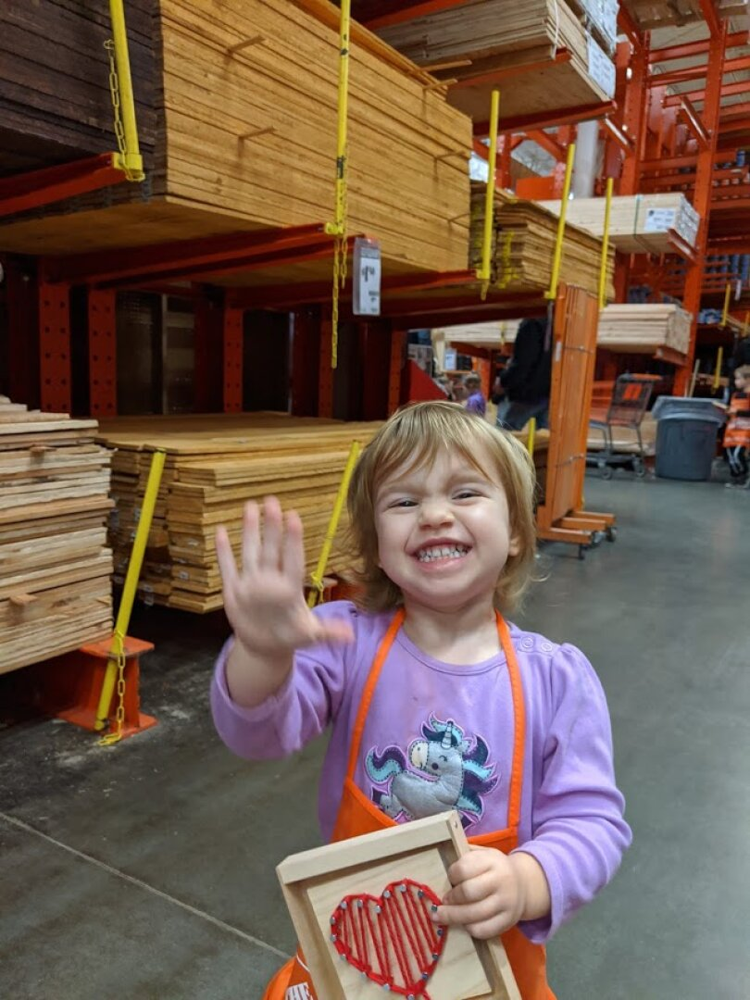
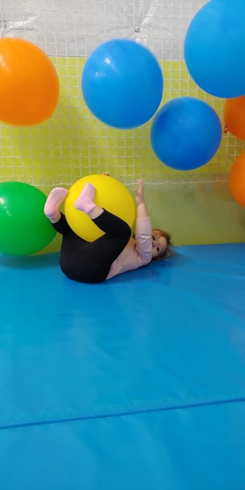
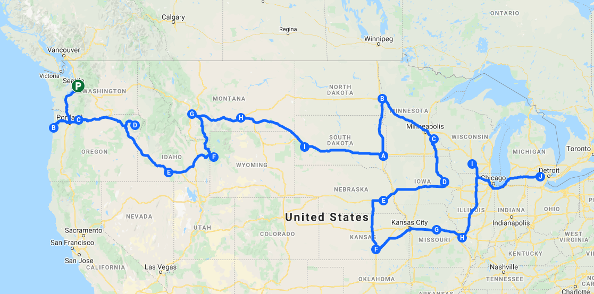

Hey friends, been meaning to write an update for a while, so many things have built up to update you on.

We're staying in an RV Resort near Fall City, a town of about 2,000 people. We are about 30 minutes from Issaquah, and 20 minutes from Andrew, Jason, and Ben (my brothers). This spot is more private than some of the others we've stayed at, and we accidentally got a site that is right in the middle of where a lot of the employees are staying. That has been a benefit as we have gotten to know them well over this time, we have consistent neighbors, and one of our neighbors even volunteered to watch Daisy for us when we were out of town for Christmas. The weather here has been very wet, this is one of the most rainy Januarys they've had in several years. Such a huge difference from Las Vegas weather, and it's nice to see green things, but I'm a bit sick of the mud.

 

We settled in just in time for Thanksgiving. It was wonderful to be able to spend it with family and friends after being on the road for a few months. The lack of friends and family nearby has been the hardest part of RV living. 

Ezri turned 2 on December 13th, we had a little party in the rec center at the RV Park, and Andrew, Jason, Ben, and their families were able to join us. Ezri loves playing with her cousins, and though she didn't really care for the cake, she did enjoy the pizza and presents.

Debbie, Steve, and Todd were able to come out for an early Christmas, and Ben hosted all of us at his roommate's house. It was wonderful seeing everyone. Emily and her family weren't able to come out, but she sent a giant order of fancy breads and pastries that were delicious. Ezri and Nathan loved playing in the shredded paper they came packed in, and loved being 'monsters' by covering themselves head to toe. 

The next week, we flew out to Tennessee to see James's family. It had been about 8 years since we last went out there, so the trip was long overdue. When so much time has passed, it's always hard to reconcile just how much people have changed with what we have in our heads. James's dad and stepmom are helping out a relative with a daughter that is one, so Ezri got to play with lots of toys while we were there, and she enjoyed having baby playtime.

 

In mid-January, Ezri and I made a 7 hour (each way) drive to Grants Pass, Oregon to see my Grandma and Grandpa, and were joined by Emily (my sister) and her 2 youngest. We also got to visit with my cousin who lives in the area and has 2 daughters near Ezri's age. It was a great visit, Ezri had so much fun with her cousins (and second cousins), and I loved the chance to catch up with Emily in person. It was also nice to find out that we can drive for so long without any major meltdowns. On both drives Ezri dumped her bag of snacks all over herself and the car, but Cheeto stains and having to vacuum were definitely not the worst that could have happened.

My license and car registration were up for renewal around my birthday, and the DMV wouldn't let me renew online, so after much discussion, we decided I'd fly out for a quick 24 hour trip to Las Vegas to get it taken care of. After 2.5 hours sitting at the DMV, my license is good for another 8 years, and my car registration is good until March 2021. I was a little worried that Ezri would give James a hard time in my absence, since she and I rarely spend any time apart. They had a grand time, and I think she hardly noticed I was gone. James took her to an event at Home Depot where they introduce kids to tools, and she made a cute heart decoration. We'll be seeking out these events in the future for sure.

Issaquah has a gym here with a daycare, but unique to them is that next door is a sports center with bounce houses and inflatable slides. They have an agreement that the gym daycare kids can come over and bounce, so Ezri loves going to the gym. We have been making it about 3 days a week on average, and I'm feeling like I'm making decent progress in getting back in shape. I will be sad to leave the gym behind when we move on to the next place.

Speaking of moving on, we have [updated the map with the tentative route for 2020](/map)! Our goal is to reach Ann Arbor, Michigan just after Halloween, and spend the winter there with Emily. Our reservation here is up on March 7th, and we'll be heading South to Pacific City, Oregon.

