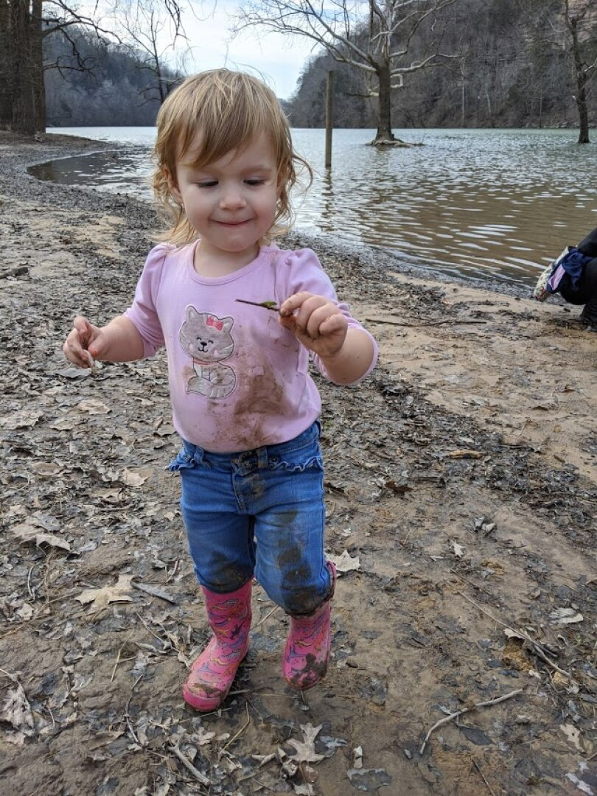
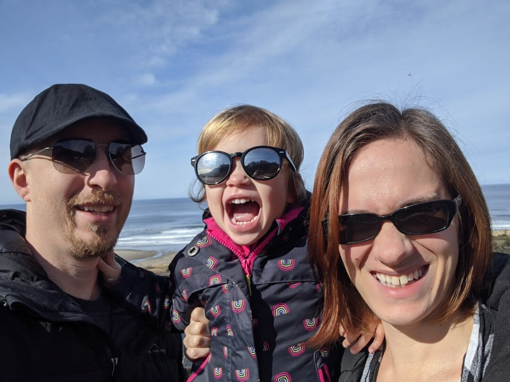
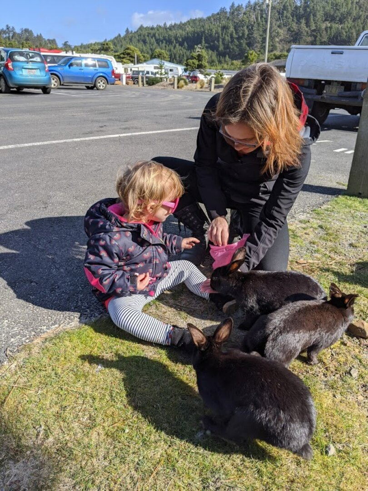
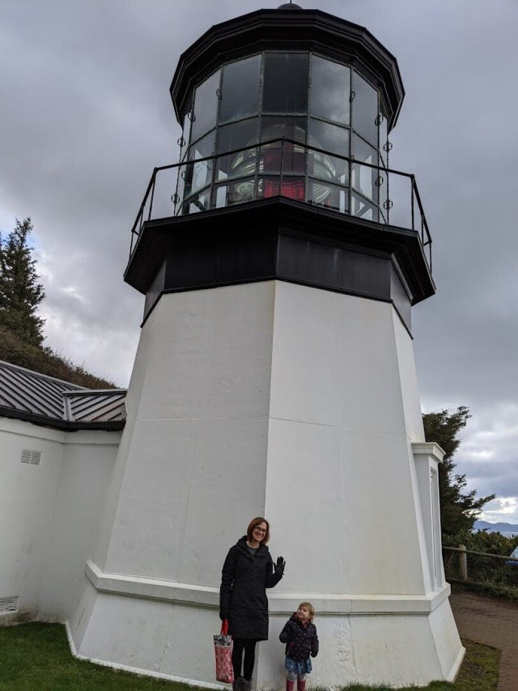
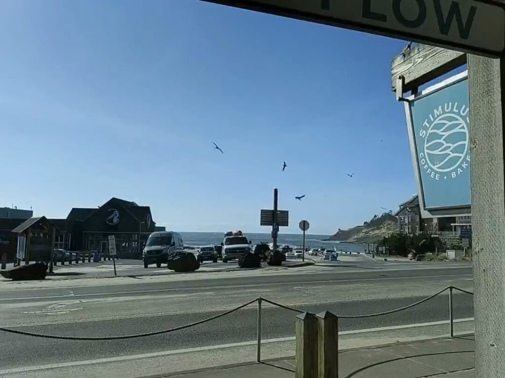
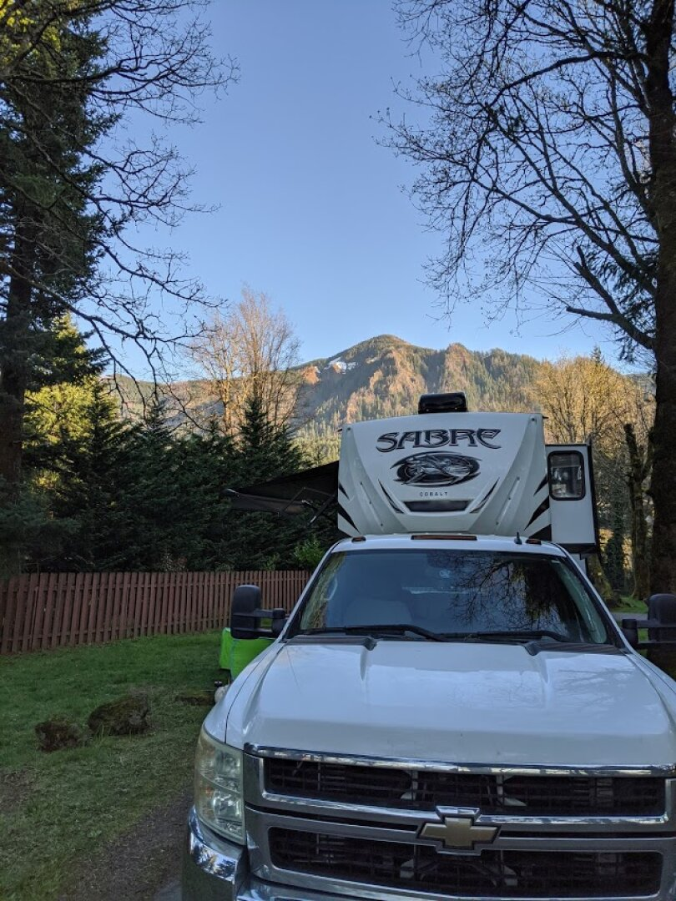
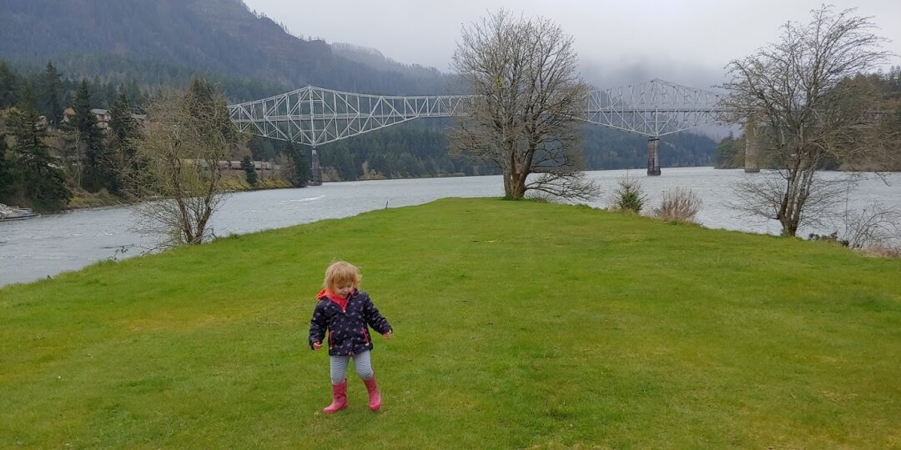
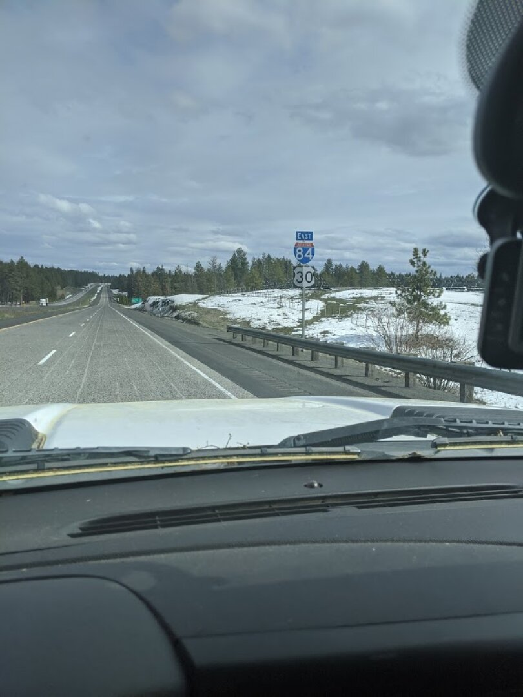

*Note: Apologies, this is a little late, it was written on April 3rd; the next post about Joseph, OR will be forthcoming.*

Our last few weeks in Fall City didn't go as we had planned, as we got a call in the middle of the night that James's step-mom, Kim, had passed away. Luckily James's work has paid bereavement leave and my work can be flexible, allowing us to fly out to Tennessee to support his dad. The funeral was beautiful, and we were able to catch up with friends and family we didn't see during our Christmas trip out there. We were all shocked by her passing, and will miss her. 

James has transitioned within Red Hat to a new role of [Technical Account Manager](https://www.redhat.com/en/blog/being-technical-account-manager-tam-day-life) which is mostly remote and will only require travel a few times a quarter. We are very excited for the increased time we'll spend together, and it's nice to not have to worry about proximity to an airport when planning our stops.

The drive from Fall City to Pacific City Oregon was relatively uneventful. Some of the mountain roads had sunken grade and other damage that made for a bumpy ride. The RV Park we stayed in was really nice, and the stay was free for us since we have a membership to Thousand Trails. The membership cost just a little more than a 2 week stay, and gives us free stays in member RV parks as long as it's been at least a week since we last were in one and we don't stay longer than 14 days. It'll be a while until we're at a location with another Thousand Trails park, but we've already more than made up for the price of membership by staying 2 weeks free in Fall City, then 2 weeks free in Pacific City.

Pacific City is directly on the coast, and has some great local restaurants. We were able to walk directly from the RV Park to the beach. Ezri loved playing in the sand, even though it was a bit chilly and windy each time we went. When we first arrived, we opted to eat out more than normal, and I am so glad we did, since we barely beat the spread of COVID-19 and subsequent closing of dine-in areas. The people we talked to were friendly, and we discovered most of the houses in Pacific City are vacation rentals. Not sure how that would impact the overall culture, but it seemed a little too tourist heavy to me. 

The RV Park we stayed at is unfortunately in an area with minimal cell signal. We were unable to make/receive phone calls from our site; text messages were hit and miss. Luckily our AT&T connection we use for wifi was slightly stronger, and we had enough Internet to stay connected via hangouts and other tools, but to get any work done we had to either go to the Family Center or a nearby coffee shop. The Family Center has a pool table, ping pong, a few arcade games, and a room of toys for younger kids, as well as several tables and chairs, so I took Ezri there almost every day so she could play while I worked for an hour.

A few miles south of Pacific City is Lincoln City, we spent the day out there shopping in their outlet mall for new clothes for Ezri, since she'd pretty much outgrown all of her 2T stuff. The town seems more kid-friendly, one store had a table covered in sand and toys with a sign encouraging kids to play, and a coffee shop there had games out on every table. It was hard to get her to go with us into the clothing stores since all she wanted to do was play marbles again! Overall, I really enjoyed the vibe and availability of stores in Lincoln City.

North of Pacific City, we went up to Netarts and Oceanside. Both had some lovely restaurants with fresh seafood. Oceanside's beach sometimes has geodes, so we walked along it looking for them. We found a few tiny ones, along with shells, and Ezri had fun digging in all of the rocks and sand. We also drove up a bit further to Cape Mears to the shortest, stubbiest lighthouse we've ever seen.

With stricter directives that are practically a shelter in place order coming to Oregon, we spent the latter half of our stay mostly within the RV Park. They locked all of the buildings, so no more Family Center, but I got furloughed right around the same time and no longer had the need to work. James still needed to get work done, so he would drive the truck to the Family Center or the coffee shop, connect to their Wi-Fi, and work from within the truck. Not the most ideal situation, but it worked. Since we were inside so much, we decided it was the perfect time to potty train. Using the 3 day method right before a car trip wasn't ideal, but we went for it. 

Unfortunately, James's brother, Joseph, ended up in the hospital while we were in Pacific City; hours from the nearest airport. We discussed having James fly out to see him, but were worried about potentially spreading COVID-19, as well as taking time off from a new job right after taking bereavement leave. James was at least able to use up his Southwest miles to fly out his mom and dad, but they were unable to get into the hospital when they arrived. Due to virus concerns, they shut it down to visitors. After a few days, Joseph was discharged and seems to be pretty much back to normal, which was a big relief.

Our drive to the next stop, Cascade Locks, Oregon, was only about 3 hours. Since Ezri was so new to potty training, we planned a few stops. The first one was harder to get to than we'd thought, so we took a chance and skipped it. At the 2 hour mark we stopped at a McDonald's for lunch and tried to have a potty break, to find that she is not OK using restaurant bathrooms. Afterwards, we drove the rest of the way to the RV Park, and then she used her little potty in the back of my car. I was shocked she made it about 3.5 hours without any accidents.

We've been in Cascade Locks for about a week and a half, and will be leaving on Saturday. Technically the RV park we are in is closed, but the owners aren't kicking out people like us who aren't vacationers. The RV Park is right next to the railroad tracks, and while the trains were exciting initially, they run most often during the night and have woken us all up several times. We're looking forward to getting a quiet night's sleep at the next place. We are disappointed we haven't really had an opportunity to check out the area or culture much, we can see some amazing cycling/walking/jogging trails by the highway and the maps show many trail-heads, but the weather has been a bit rainy and cold whenever we have the time to go, and the trail-heads look like they are closed anyway.

The next stop is [Joseph, Oregon](https://www.nytimes.com/2017/07/20/travel/wallowa-valley-mountains-joseph-oregon-culture.html). We originally planned to stay 2 weeks there, but are discussing whether we should stay until the socialization limitations are lifted, as the whole point of this journey is to get a feel for different places, and we aren't able to do that without interacting with people.

*Since we updated this post late, here's a picture of part of the drive to Joseph, Oregon:*

