Whew! Time really flies, been meaning to write another post for a while. We just left Joseph, Oregon after staying there about 3 months. With things mostly shut down, we decided it was best to hunker down in one place until things started opening back up again.

Joseph is just north of Wallowa Lake, and we made it to the north end of the lake a few times for Ezri to play in the water. If she had her way, we'd never leave. We spent an hour on a rented paddle boat out on the South end of the lake, Ezri alternated between helping pedal and leaning over the edge to pick up sticks or splash in the water.

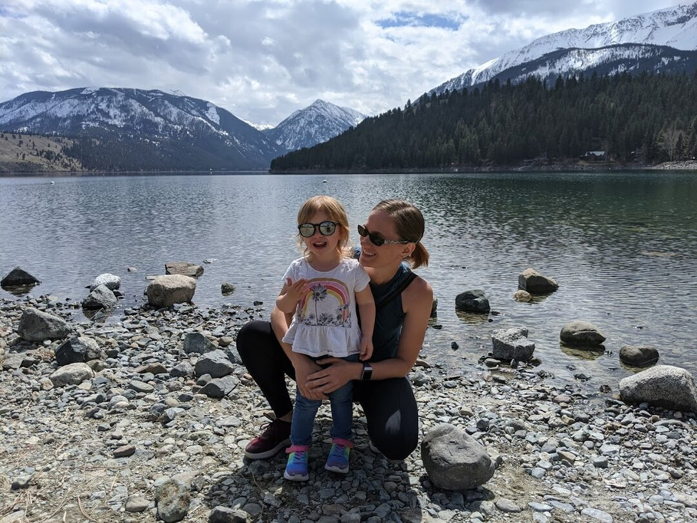

Joseph has a very walkable, picturesque Main Street we both ran and walked up and down many times. Our RV Park was just off of Main Street, so having direct access was really nice. There are bronze sculptures all around the town, and Ezri's favorite by far is a mom and baby horse 'hugging'. She insisted we get a picture in front of them. There are a few different restaurants we enjoyed, an old style soda fountain and ice cream shop, and a chocolate shop I got a few too many chocolate truffles from. The mix of small town and tourist attraction made for a really nice culture, and I think we'll have a hard time topping the welcoming, well maintained main street.

Our first month, we were almost the only ones in the RV park, but after that we got some lovely neighbors who we had a lot of fun talking with, Anna and Joanne (from 6 feet of course!). We have missed having close connections while on the road, and it was so nice to make some friends. They also gave me an awesome haircut as a parting gift, which I'm really enjoying.

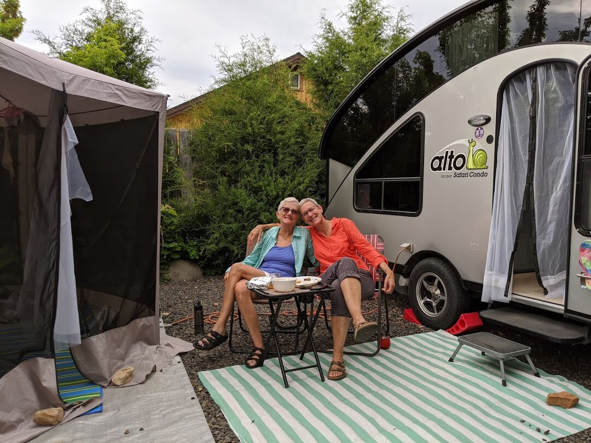

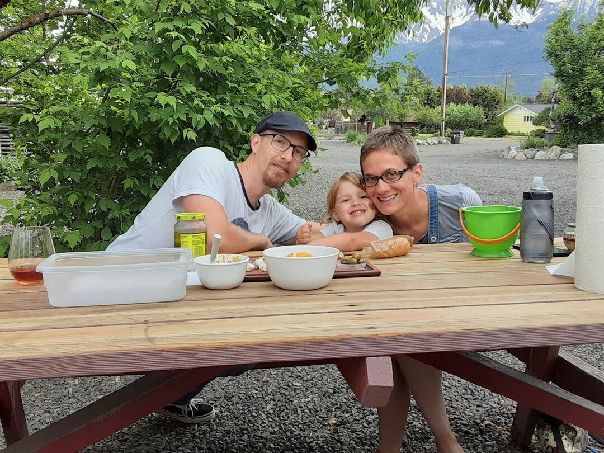

We had Easter in Joseph, and were worried Ezri would miss having other kids around for egg hunting. We should have known she wouldn't mind at all; she was too focused on finding all the eggs!

With Ezri getting a little older, I've been able to start doing more projects, so I've made a few masks for us, as well as 2 dresses for Ezri. I've restarted a half-done knitting project too, and am looking forward to wrapping it up and starting on another.

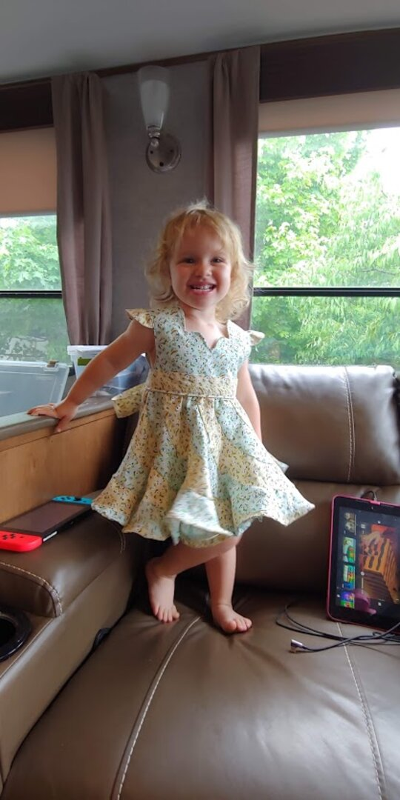

James has gotten back on his bike, to discover that a road bike and dirt roads don't go together very well. He upgraded to a gravel bike (James says: [2019 Salsa Warroad Force 1 650b](https://salsacycles.com/bikes/warroad/2019_warroad_carbon_force_1_650) with a 48T chainring upgrade + Power2Max NGEco power meter), and convinced me to get a new gravel bike too. We also got Ezri a trailer that lets her help pedal. She has been practicing on it, but the weather turned cold and windy right as we got it, so we haven't gone out as a family yet.

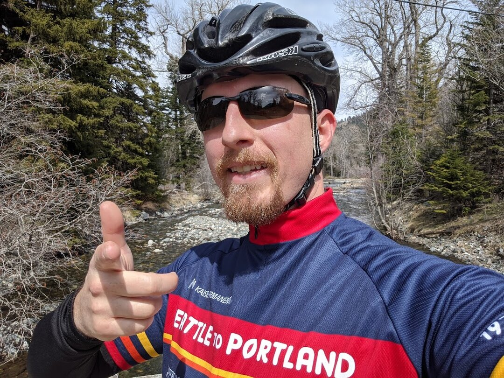

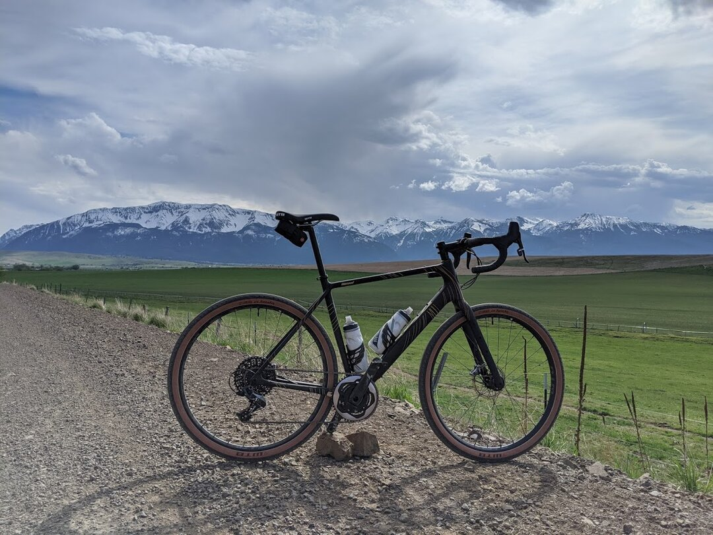

There's an old railroad that cuts through the edge of Joseph but no longer has trains on it. It's great for walking on, and there's a company that has pedal cars you can rent to take on it too. By the time they were allowed to reopen, we only had 1 weekend to try them, and it got too windy and cold, so we've got something on the list to do next time we're in the area.

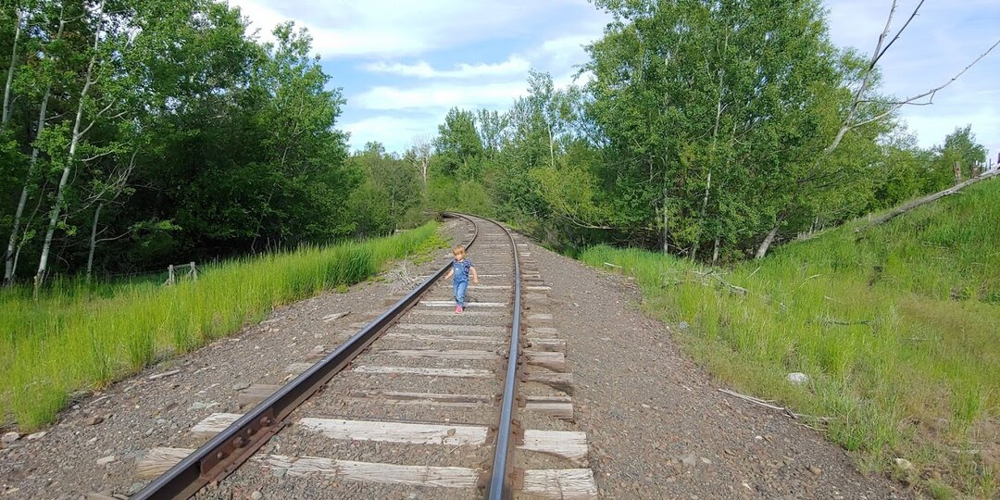

Overall, Joseph has friendly people and beautiful views, though it lacks diversity and access to stores (the nearest big box is WalMart in La Grande, over 1.5 hours away). We also would have about a 2 hour drive to the nearest airport, and while James isn't traveling weekly anymore, he'll still be visiting clients about once a quarter post-covid.

### 4 states in under 48 hours

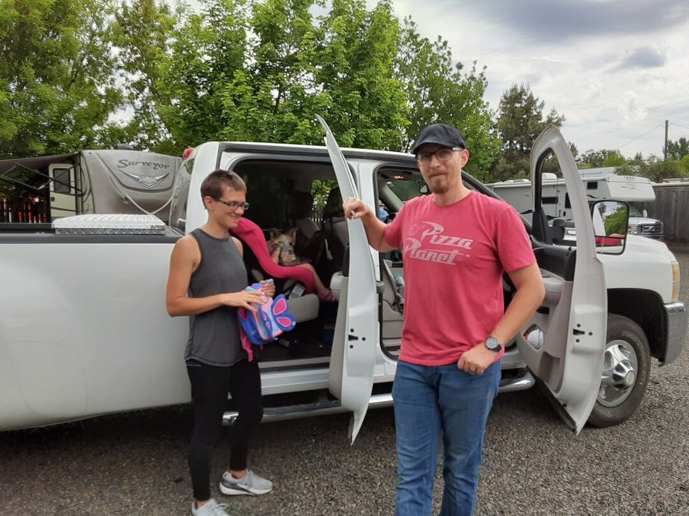

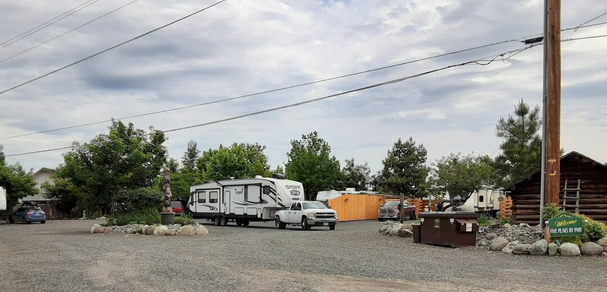

Leaving Joseph, we decided to break our trip into 2 days rather than make the nearly 8 hour drive in one. We drove from Oregon, through Washington, then stopped overnight in Coeur D'Alene, Idaho in an RV park with lake access. Ezri played in the water even though it was a little chilly. The RV park was nice, but huge compared to the tiny one we came from. It felt strange to see so many RVs and people.

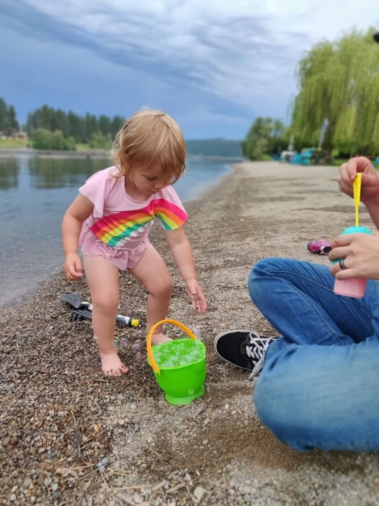

The next day, we grabbed breakfast and headed out to our current location: Kalispell, Montana. Kalispell is a smallish town of about 30,000 people, with amenities like Target, Costco, and JoAnn's. The RV park we chose [Montana Basecamp](https://montanabasecamp.com/) is on a well maintained bike/jogging path; we don't even need to get on a road to access it from the RV park. We plan to stay here for a month. 

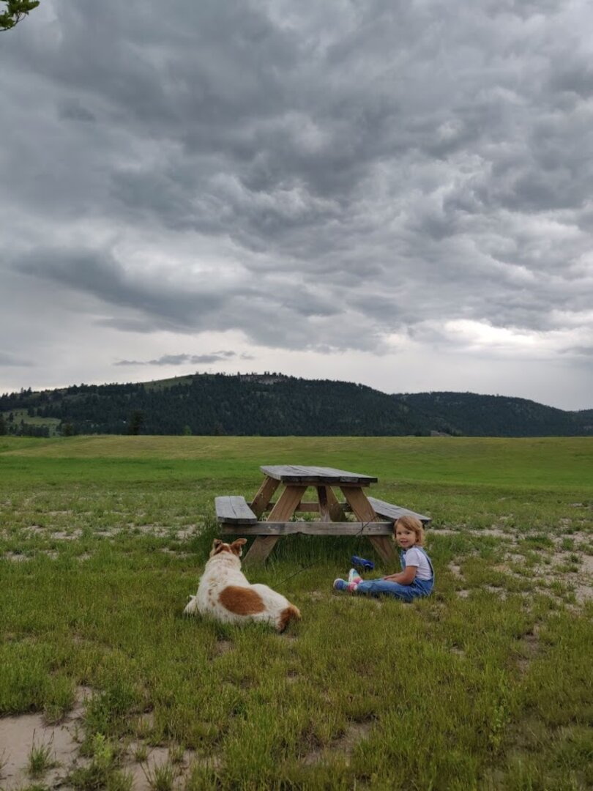

Proving that the world is much smaller than we think, James saw a familiar Wi-Fi access point while setting up, to discover his coworker and fellow RVer Michael Kidd and his wife Lehnanne is staying a few sites down from us... We actually first met them in person about a year ago in Las Vegas just before buying our fifth wheel! It was great back then talking about what living on the road would be like.

You can check out their travel blog at https://turtleherding.com/. We look forward to catching up with them while we're here!