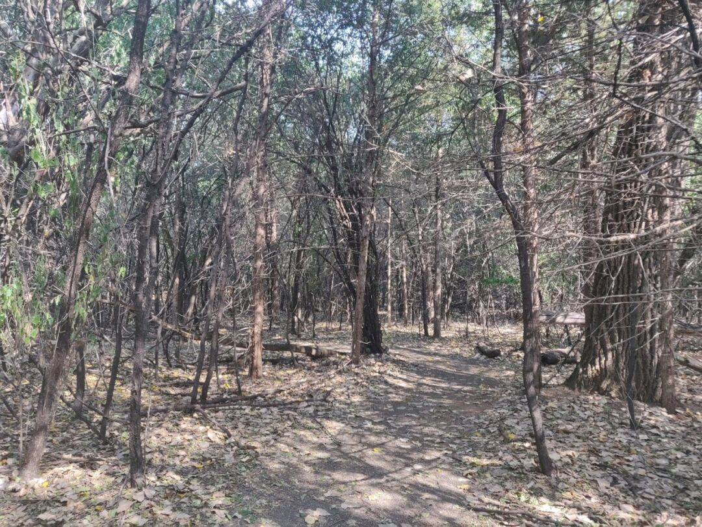
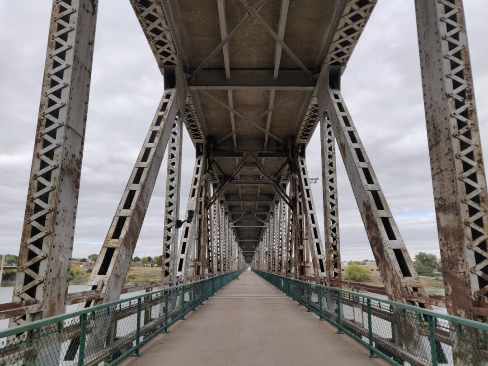
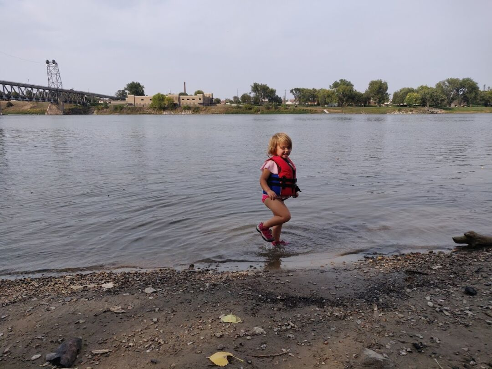
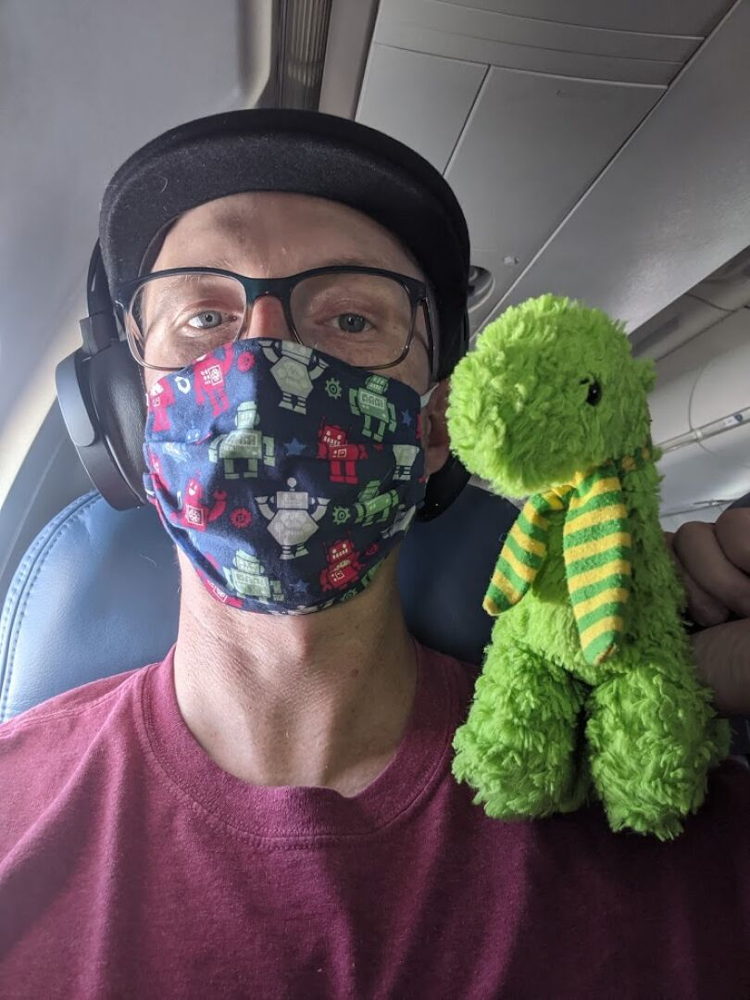
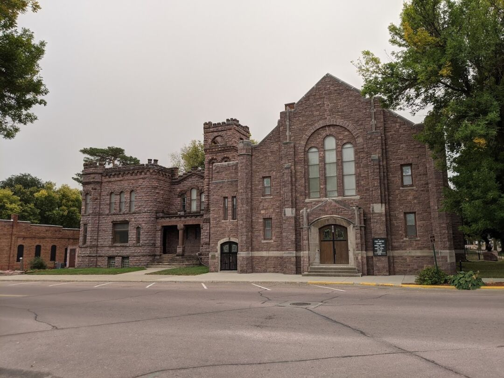
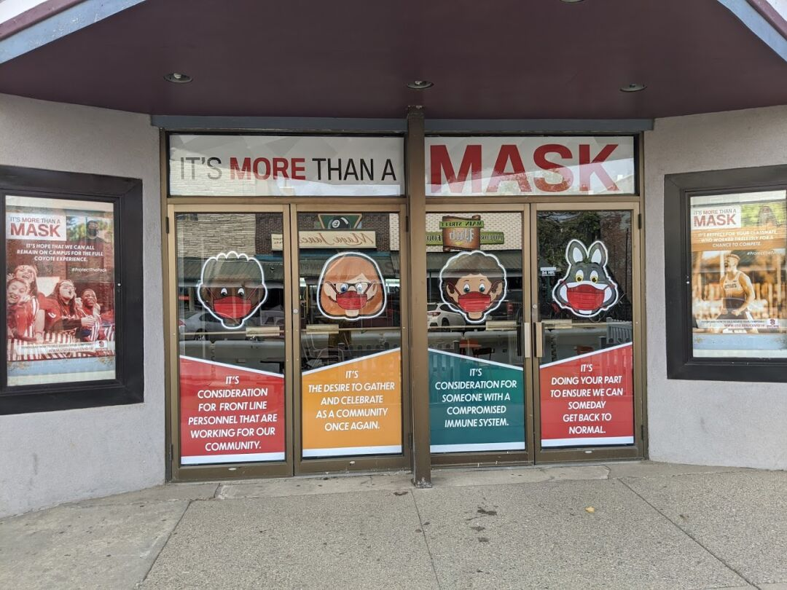
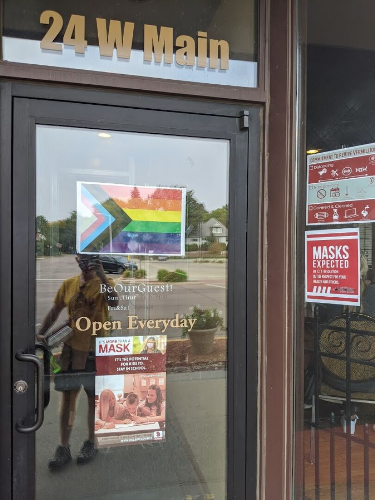
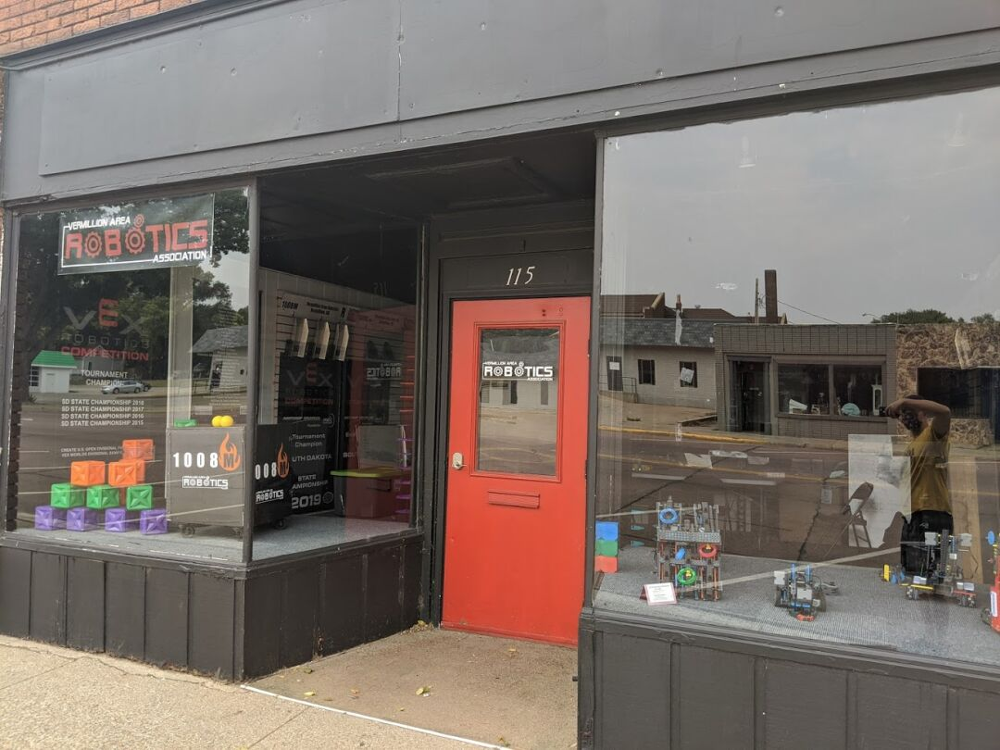
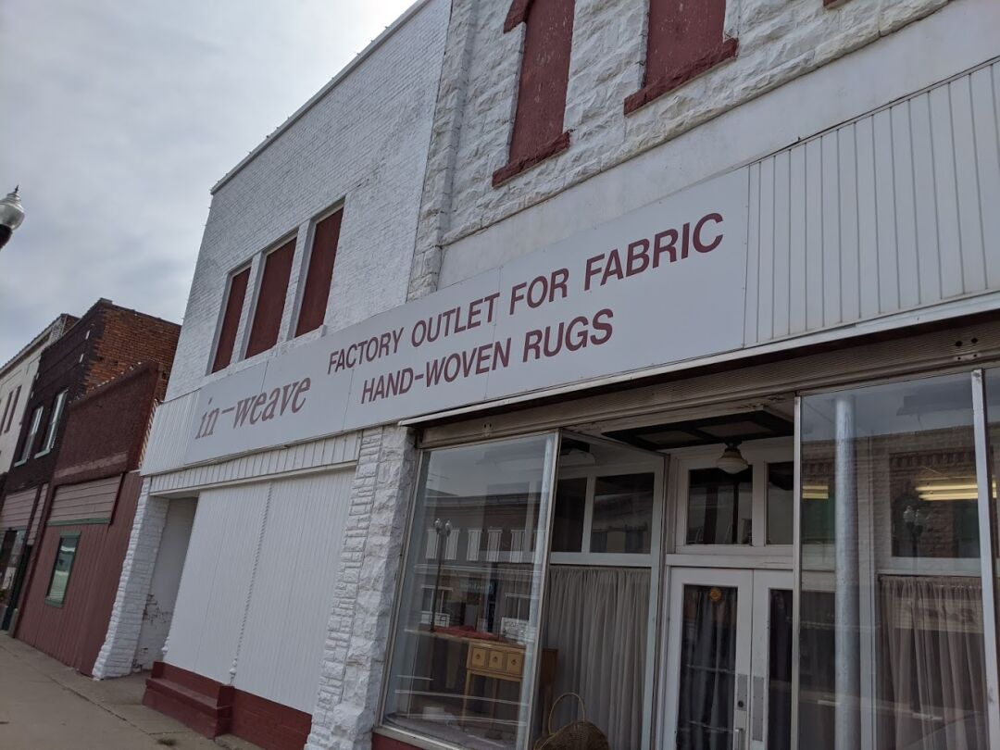
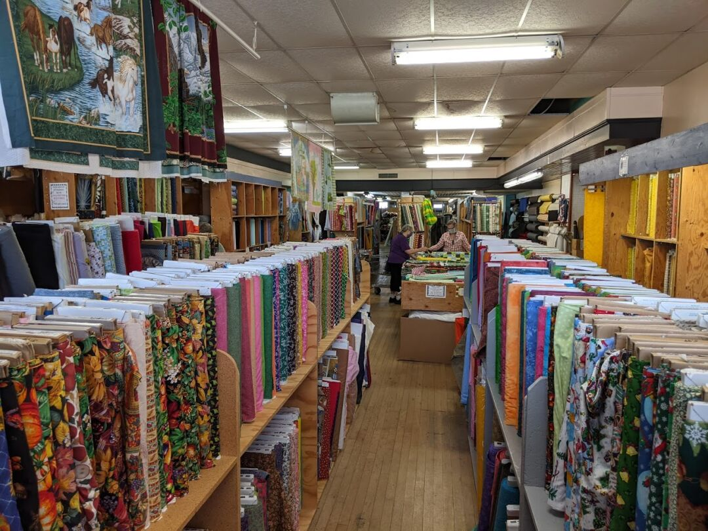

Yankton spans across the state line, though most of the city is in South Dakota. The RV park we stayed in is right next to a 2 layer former rail/car bridge that is now strictly for pedestrians. We were about a mile from the downtown via the bridge, so we used it quite a bit. Underneath the bridge, they also have a few miles of rough trail that Ezri and I ran on. It was enjoyable, and she thought it was extra fun with all of the bumps and turns, but I ran face first into several spiderwebs, one with the spider still in it.

We also had easy access to the Missouri River, with nice sandy banks that we attempted to make sand castles on, but ultimately couldn't get the moisture level correct.

The Yankton downtown is nice, but doesn't have as much going on as some of the other places we've been. There's not a lot of foot traffic or the type of businesses you window shop at.

While in Yankton, we officially became South Dakotans! We got new licenses, but were surprised to find out that they don't have a DMV; licenses and registration are handled by 2 completely different departments. We should have registered our vehicles while in the Black Hills, so James had to make a flight from our current stop to take care of the truck and RV, while I'll make a flight later on to get the car switched over.

The reason we switched residency mostly comes down to the registration, in Nevada we were paying about 3x as much, and they required a Nevada smog check each year, that we can't get since we aren't near there. In South Dakota we'll be able to renew each year without worrying about smog.

### Vermillion, SD

Vermillion is about a half hour from Yankton, so we also checked out the area there. Overall, we liked Vermillion a little better, there are a few more interesting things and it's a bit more progressive, probably due to the fact that it's a college town. They aren't allowed to mandate masks due to state rules, but they have a 'masks expected' policy. We also saw several rainbow signs in business windows showing support for LGBTQ rights.

Vermillion's main street has the only breakfast place we could find that is open on Sunday (between both Vermillion and Yankton) and is very walkable with a few more browsable shops than Yankton had. They also have a gorgeous old church that looks like a castle.

Also on the main street we found a robotics club for kids that Ezri wanted to join immediately. She's a bit too young, but it's nice to see STEM related things like that.

I had a hard time finding any fabric stores in the area with anything besides quilting fabric, so we made the hour's drive to Hawarden, Iowa to a fabric outlet. It was interesting seeing this tiny town with hardly anything going on with such a large fabric store. I overheard other customers and it seems many drive hours to get there. I got some 'water damaged' denim for 1.99 a yard and corduroy for 2.99 a yard that should keep me busy for a few weeks.

