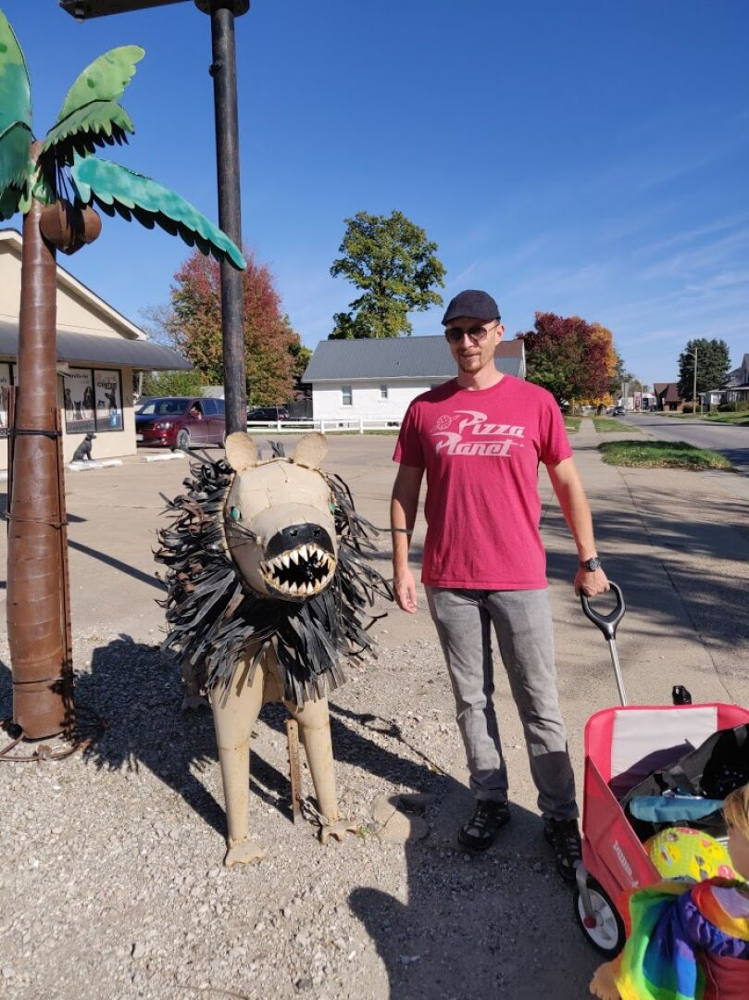
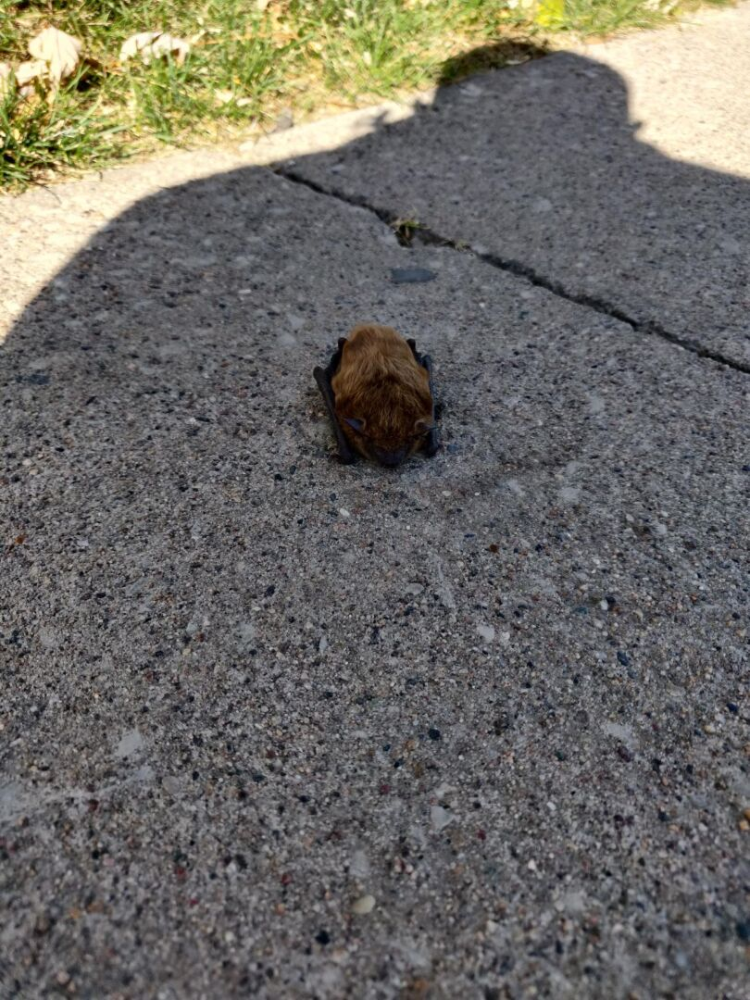
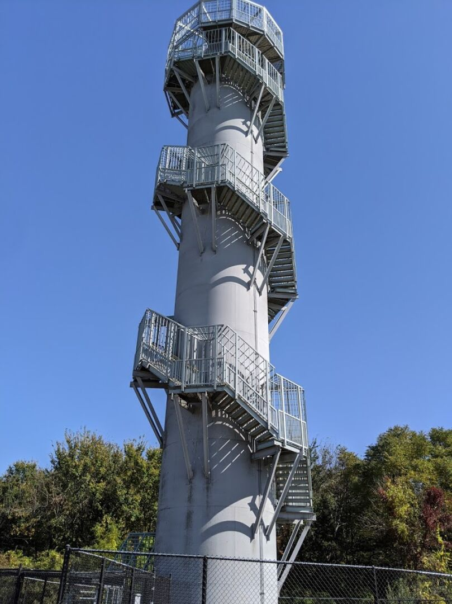
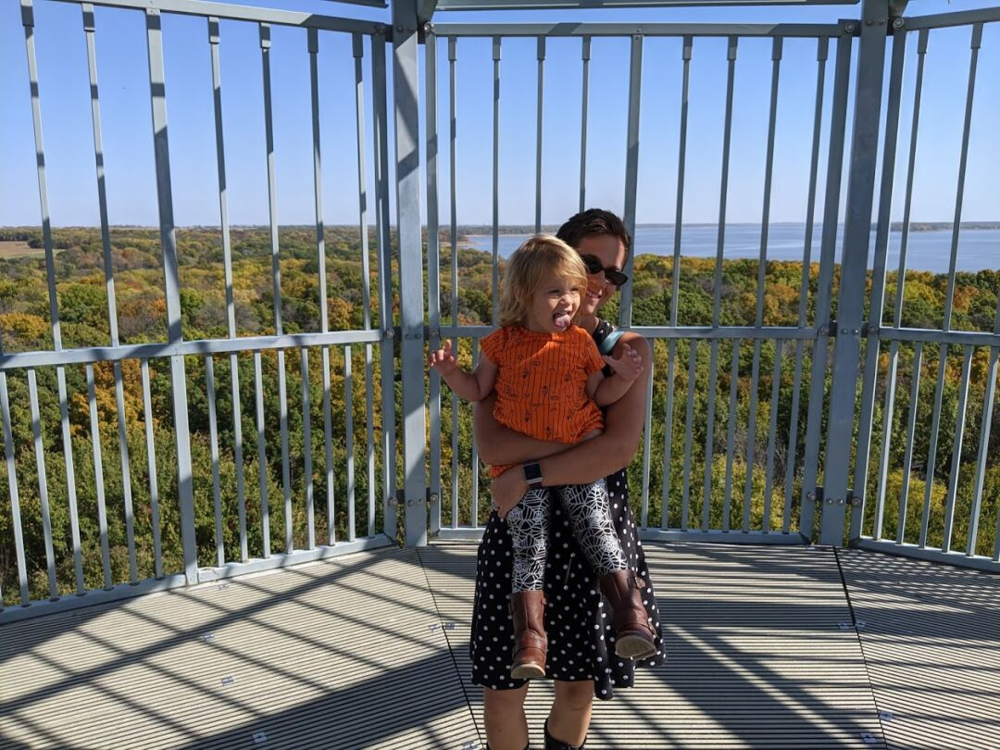
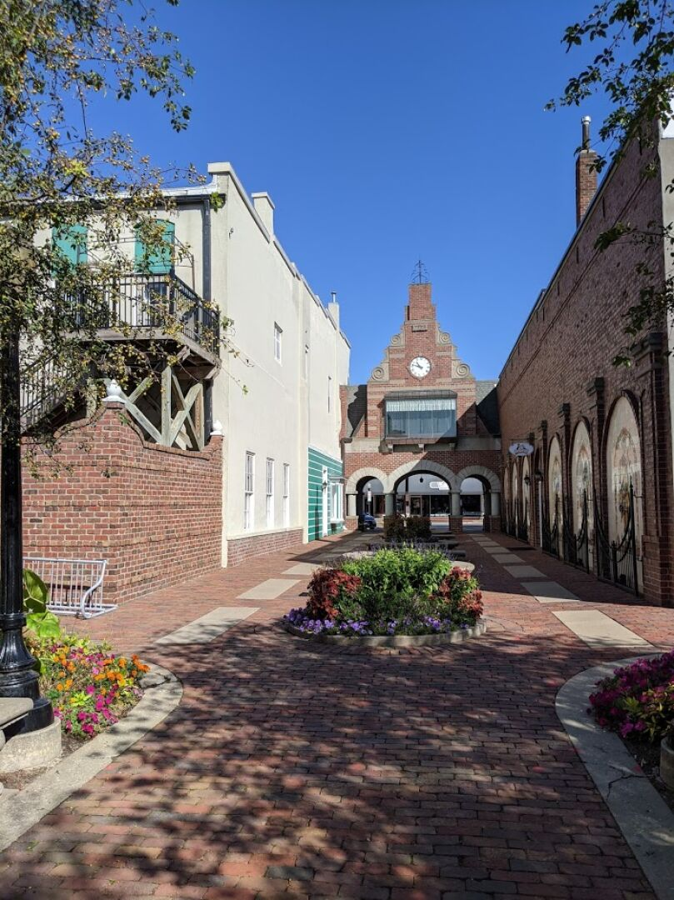
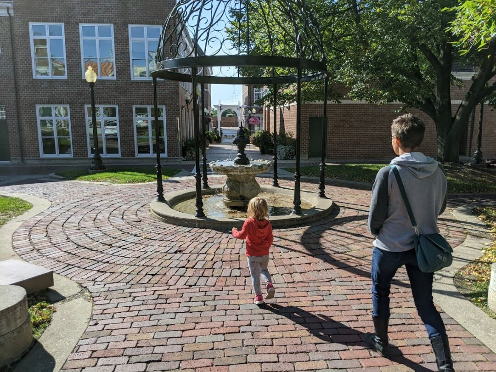
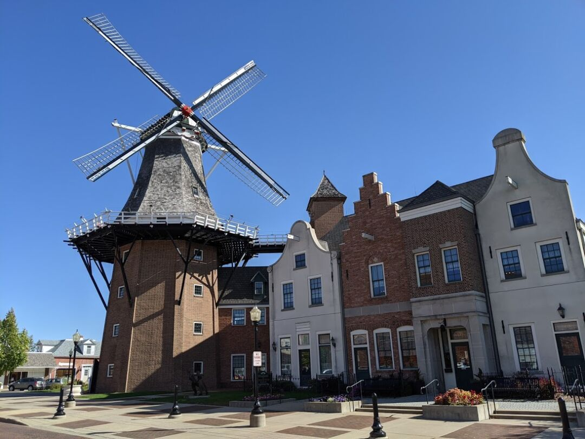
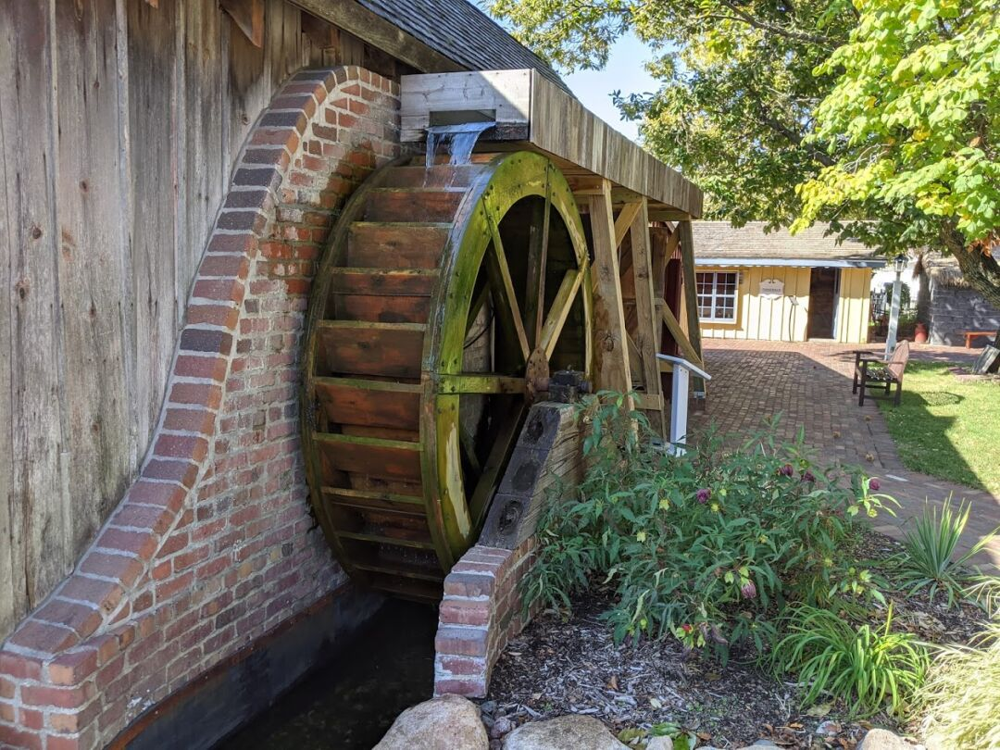
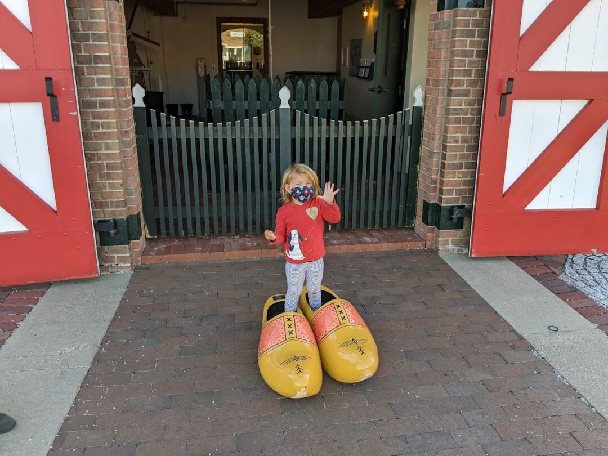

### Knoxville, Iowa

Knoxville is a pretty small town (about 7k people), and doesn't have a lot going on other than the sprint car raceway and museum they have. We stayed about a mile from a nice park, so Ezri had us walking to the playground frequently. If she had her way, we'd do nothing else.

One thing we noticed about this area is that the towns all seem to have a central square with city hall, and their main street surrounds the square. They had a farmer's market 2x a week in the square, and we went once; there were only a few stalls, but we bought a bunch of green peppers as we've all been on a pepper salad kick.

The weather has been really nice, so I got a decent amount of running in, and we also tried to walk whenever we could. During one of our walks we came across the creepiest lion statue we've ever seen in front of a veterinary office.

During one of my runs, I noticed a bat in the middle of the sidewalk. I stopped, called James, and discussed what to do, we decided to see if it was still there on my way back. Sure enough, poor guy was still there, and refused to move from the sidewalk. I tried gently prodding with a stick but it just showed its teeth rather than move. I finished my run, then we doubled back with the car, a box, and some rags to gather it up. We contacted a rescue and were instructed to try putting it on a tree, so we picked one on the edge of the RV park that we could check back on, and tried it. We were shocked by how quickly the bat went from unmoving to climbing happily up the tree. Turns out if they fly during the day they get easily disoriented and scared, and are unable to take off from the ground, so they just kind of hunker down and wait until night. 

A little ways north is Cordova Park, which has an observation tower you can climb for $.50 a person. We paid our quarters, went in, and noticed a bunch of ladybugs all over the tower. Then came the biting gnats, and as we got up a little higher, the yellow jackets. I guess we didn't pick the best time of year, but we only spent a few seconds at the top before hurrying back down to avoid all the flying pests. I was a little disappointed as the views would have been really nice had we had the time to enjoy them.

### Pella, Iowa

If we had been able to find an RV park in Pella, I think that's where we would have stayed, the town has more potential for us long term than Knoxville. Pella is a very unique town of about 10k people, settled by a religious group from the Netherlands in 1847. They have held onto their Dutch heritage, with many buildings in the center of town built with Dutch architecture, a yearly tulip festival, a canal in the middle of the street, and a working windmill.

We took a tour of the windmill and surrounding museum, which included:

A massive mini train village of buildings found in the Netherlands

Several preserved historical buildings from the early days of the town

Some giant shoes that Ezri loved trying on

Pella may be a familiar name to you, the main company in town is Pella windows, with some of the towns income coming from tourism as well.

We also enjoyed having Poffertjes (tiny pancakes covered in powdered sugar) and Stroopwafels at the local chain coffee shop, DutchFix. When telling locals of our travels and the reason for them, the most common response we got is "you'll love it here, the schools are great and there are a lot of churches!".

